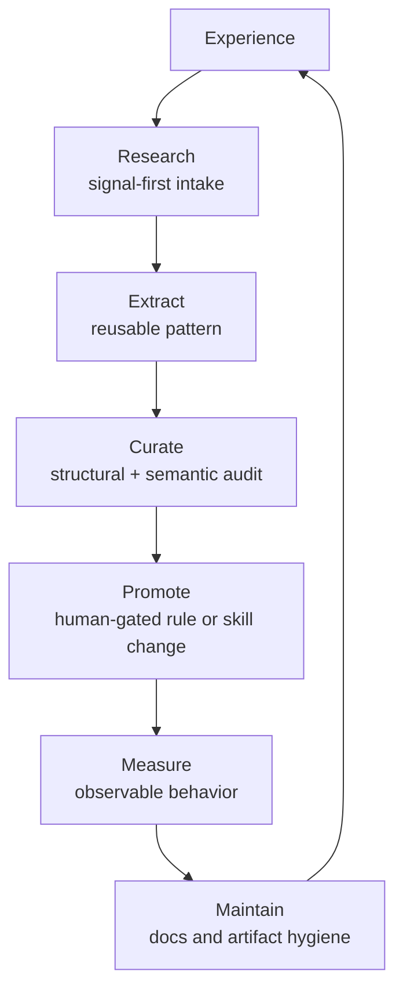

Language: [English](README.md) | 日本語

# Agent Knowledge Cycle (AKC)

[](https://doi.org/10.5281/zenodo.19200726)
[](https://deepwiki.com/shimo4228/agent-knowledge-cycle)
[](https://gitmcp.io/shimo4228/agent-knowledge-cycle)

**AI エージェントのための知識サイクル — それを形作る人とともに成長する。**

Agent Knowledge Cycle (AKC) は、永続的な AI エージェントを運用する人の
ための 6 フェーズの知識サイクルである。エージェントの反復経験を、保守
されたスキル・ルール・ドキュメントへ変換しつつ、将来の振る舞いを形作る
変更は human approval の下に置く。AKC は harness ではない。Everything
Claude Code (ECC) のような harness の上で動き、運用者の変化していく
意図と harness をアラインし続ける。

関連論文: *Harness Alignment and Harness Drift: Why Intent, Unlike
Correctness, Resists Automation* — doi:[10.5281/zenodo.20578272](https://doi.org/10.5281/zenodo.20578272)

## AKC とは何か

AKC は 1 つの制約から出発する。エージェント能力が伸びるほど、希少資源は
計算資源やコンテキストではなく、ループを steer するための **人間の注意と
判断** になる。サイクル全体はこのボトルネックを中心に形作られている。

目標は、個別出力の正しさだけではなく、時間をまたいだ **intent alignment**
である。テストやリンタは、ある結果が仕様を満たすかを確認できる。しかし、
変わり続ける harness が、運用者が今意味していることにまだ合っているかを
完全には確認できない。AKC は Research, Extract, Curate, Promote,
Measure, Maintain の反復判断を通じて、その問いを可視化し続ける。

ループは双方向である。エージェントの振る舞いが整うにつれ、運用者もまた、
何を残し、何を昇格し、何を退けるべきかの判断を研いでいく。だから AKC は、
サイクルが人の *ために* ではなく、人 *とともに* 成長すると言う。

| 事実 | 内容 |
|---|---|
| プロジェクト種別 | DOI 登録済み研究 / 仕様リポジトリ + 最小リファレンス実装 |
| 著者 | Tatsuya Shimomoto ([@shimo4228](https://github.com/shimo4228), ORCID [0009-0002-6168-4162](https://orcid.org/0009-0002-6168-4162)) |
| 現行リリース | v2.4.0, 2026-06-30 |
| DOI line | Concept DOI [10.5281/zenodo.19200726](https://doi.org/10.5281/zenodo.19200726); 最新 archived release DOI [10.5281/zenodo.21067957](https://doi.org/10.5281/zenodo.21067957) |
| ライセンス | MIT |
| 主対象 | coding agent / 永続的 AI harness の運用者。副対象は agent memory や human-AI co-development loop を比較する研究者 |
| AI navigation | [`graph.jsonld`](graph.jsonld) が concept map、[`llms.txt`](llms.txt) が routing、[`llms-full.txt`](llms-full.txt) が自己完結した事実参照 |

## サイクルを導入する

最も軽い導入経路は、単独リポジトリ
[**shimo4228/akc-cycle**](https://github.com/shimo4228/akc-cycle) のルール
ファイルである。フェーズ別スキルを入れなくても、AI エージェントに 6
フェーズの振る舞いを渡せる。

### クイックインストール

```bash
# github.com/shimo4228/akc-cycle のクローンから、ルールを
# エージェントのルールディレクトリにコピーする。
cp rules/common/akc-cycle.md ~/.claude/rules/common/akc-cycle.md
```

特定フェーズの段階的な実行ガイドが必要なら外部スキルを使う。通常の対話の
中からサイクルを自然に立ち上げたいなら、ルールファイルだけでよい。

## なぜ AKC か

### ボトルネックは移動した

多くの agent framework はエージェント側を最適化する。より多くのツール、
メモリ、コンテキスト、自動化。AKC は逆を問う: ループの中の人間が持つ注意
と判断の予算が固定だとしたら、その予算を浪費しないように maintenance
cycle はどう形作られるべきか？

| maintenance pressure | AKC の応答 |
|---|---|
| スキルが陳腐化する | `skill-health` が構造的負債を検出し、`skill-stocktake` が意味的品質を監査する |
| ルールが実践とずれる | `skill-comply` が実際の行動遵守を測定する |
| 知識が散在する | `rules-distill` が反復パターンをルールへ昇格する |
| ドキュメントがドリフトする | `context-sync` が文書役割と事実を新鮮に保つ |
| 同じ判断を毎回やり直す | `learn-eval` と Promote が再利用可能パターンを保存する |
| 取り込みが消化を超える | `search-first` が Research を signal-first に保つ |

### 正しさだけでなく、意図とのアライン

正しさは、出力が明示された基準を満たすかを問う。Intent alignment は、
運用者の判断が使い込みのなかで変わっていくとき、エージェントの振る舞いが
まだその意図を追えているかを問う。AKC は、この configuration layer での
活動を **harness alignment** と呼び、その failure mode を **harness drift**
と呼ぶ。完全な導出は
[ADR-0017](docs/adr/0017-harness-alignment-and-drift.md) と関連論文にある。

### サイクルは人間も変える

Curate と Promote は受動的な保存ではない。運用者に、どの知識を残し、どれ
を将来の振る舞いに効かせるべきかを判断させる。Measure は、その判断が実際
に振る舞いを変えたかを検査する。時間が経つにつれ、エージェントはより一貫
し、人間はその一貫性を判断する力を上げていく。

## サイクル

テキスト等価: AKC は経験を 6 つの現在フェーズで durable behavior に変換
する。Research が intake を絞り、Extract が再利用可能パターンを捕捉し、
Curate が蓄積物を監査し、Promote が選ばれたパターンを振る舞い形成ルールへ
移し、Measure が振る舞いの変化を検査し、Maintain がドキュメントと artifact
を整合させる。



フェーズ集合と phase-to-skill binding は可変なスナップショットであり、AKC
の固定された本質ではない。
[ADR-0019](docs/adr/0019-cycle-structure-is-provisional.md) を参照。

### 現在の足場

| Phase | 現在の外部スキル | 目的 |
|---|---|---|
| Research | [search-first](https://github.com/shimo4228/search-first) | 広く探索し、次の行動を変える signal だけを取り込む |
| Extract | [learn-eval](https://github.com/shimo4228/learn-eval) | セッションの再利用可能パターンを品質ゲート付きで抽出する |
| Curate | [skill-health](https://github.com/shimo4228/skill-health) + [skill-stocktake](https://github.com/shimo4228/skill-stocktake) | 意味的な skill review の前に構造的負債を検査する |
| Promote | [rules-distill](https://github.com/shimo4228/rules-distill) | 反復パターンを durable rule に変換する |
| Measure | [skill-comply](https://github.com/shimo4228/skill-comply) | エージェントが実際にスキルとルールに従うかをテストする |
| Maintain | [context-sync](https://github.com/shimo4228/context-sync) | 文書役割を清潔にし、事実を新鮮に保つ |

## ルールとスキル

AKC には 3 つの導入レベルがある。

| レベル | 使う場面 | 導入するもの |
|---|---|---|
| Rules | 通常の agent conversation にサイクルを効かせたい | [shimo4228/akc-cycle](https://github.com/shimo4228/akc-cycle) の 1 つのルールファイル |
| Cycle skills | 特定フェーズの詳細ワークフローが必要 | 上記の phase skills |
| Design-pattern skills | code/LLM layering や signal-first research の再利用可能な guidance が必要 | [when-code-when-llm](https://github.com/shimo4228/when-code-when-llm), [code-and-llm-collaboration](https://github.com/shimo4228/code-and-llm-collaboration), [signal-first-research](https://github.com/shimo4228/signal-first-research) |

スキルは足場である。最も軽い durable form はルールで残る。
[docs/scaffold-dissolution.md](docs/scaffold-dissolution.md) を参照。

## このリポジトリの中身

| 領域 | 内容 |
|---|---|
| 決定記録 | [`docs/adr/`](docs/adr/) に 16 ADR。0001, 0006, 0007 は v2.0.0 extraction 由来の恒久 gap |
| 機械可読 surface | [`graph.jsonld`](graph.jsonld), [`llms.txt`](llms.txt), [`llms-full.txt`](llms-full.txt), [`CITATION.cff`](CITATION.cff) |
| 仕様 | [`schemas/episode-log.schema.json`](schemas/episode-log.schema.json), [`schemas/knowledge.schema.json`](schemas/knowledge.schema.json) |
| リファレンス実装 | [`examples/minimal_harness/`](examples/minimal_harness/): 3 メモリ層と 2 段階 distill pipeline の dependency-free Python demo |
| 導入ポインタ | [`docs/akc-cycle.md`](docs/akc-cycle.md): standalone rules repo への pointer |
| routing map | [`docs/CODEMAPS/architecture.md`](docs/CODEMAPS/architecture.md): canonical file-level navigation index |

## 設計原則

1. **Composable** — 各フェーズは独立に使える。
2. **Observable** — Measure は振る舞いを観測する。thinking-centric phase では agent text も観測対象である ([ADR-0016](docs/adr/0016-measuring-thinking-centric-phases.md))。
3. **Non-destructive** — 振る舞いを形作る変更は提案され、人間が承認する。自動適用しない ([ADR-0005](docs/adr/0005-human-approval-gate.md))。
4. **Tool-agnostic in concept** — Claude Code の実践から設計されたが、永続的 agent harness なら移植可能。
5. **Evaluation scales with model capability** — 評価方法はモデルの推論深度に合わせる。
6. **Scaffold dissolution** — サイクルが内在化されると、スキルは不要になってよい。
7. **Code-LLM Layering** — コードは制御フローと durable state を所有し、LLM は意味を所有する ([ADR-0008](docs/adr/0008-code-and-llm-collaboration.md))。
8. **Human cognitive resource is the bottleneck** — 各フェーズは注意と判断を守る ([ADR-0010](docs/adr/0010-human-cognitive-resource-as-central-constraint.md))。
9. **Genre neutrality** — AKC は任意の coherent knowledge body に適用できる mechanism であり、中身に対する立場ではない ([ADR-0011](docs/adr/0011-cycle-applies-to-any-knowledge-body.md))。

## Limitations

双方向ループは人間側にも失敗しうる。ADR-0014 は 3 つの mechanism-level
failure mode を名づける: **gate complacency**, **deskilling**,
**delegation-feedback divergence**。AKC はこれらのリスクを消せるとは主張
しない。リスクを明示し、human approval gate、Curate、Promote、Measure を
構造的な防御として残す。

artifact 側の failure が **harness drift** である。スキル、ルール、プロンプト、
ドキュメントが、運用者の変化する意図から少しずつ外れていく。人間側の失敗
と artifact 側の失敗は複合しうるため、AKC は maintenance を一度限りの設定
ではなく cycle として扱う。

## ハーネスエンジニアリングとの関係

AKC と harness engineering は、エージェントの振る舞いをより信頼できるもの
にするという目的を共有する。ただし層が違う。

| 層 | 問い | 典型的な道具 |
|---|---|---|
| Harness engineering | 「この出力は初回で正しいか？」 | リンタ、テスト、プロンプト、ツール、benchmark-driven harness optimization |
| Agent Knowledge Cycle | 「harness はまだ運用者の意味するものとアラインしているか？」 | human-gated な Curate / Promote、compliance measurement、documentation maintenance |

Harness engineering は scaffold を改善する。AKC は、運用者の意図と判断が
変化するなかで scaffold を生きた状態に保つ。層の分離は
[ADR-0009](docs/adr/0009-akc-is-a-cycle-not-a-harness.md)、harness alignment
語彙は [ADR-0017](docs/adr/0017-harness-alignment-and-drift.md) を参照。

## カスタマイズ

ルール、スキル、スキーマ、リファレンス実装は自身のエージェントに合わせて
fork / rewrite してよい。AKC が定義するのは実装ではなくサイクルである。
重要なのは、経験が Research, Extract, Curate, Promote, Measure, Maintain
を閉じたループとして流れ、durable behavior change の前に human approval が
入ることだ。

## 出自

このアーキテクチャは 2026 年 2 月に Tatsuya Shimomoto
([@shimo4228](https://github.com/shimo4228)) によって最初に提案・実装された。
最初の 5 つの cycle skills は 2026 年 2 月から 3 月にかけて
[Everything Claude Code (ECC)](https://github.com/affaan-m/everything-claude-code)
に貢献された。`context-sync` は独立に開発された。

## 引用方法

AKC を利用・参照する場合は、[`CITATION.cff`](CITATION.cff) の archived
release metadata を引用してほしい。

```bibtex
@software{shimomoto2026akc,
  author       = {Shimomoto, Tatsuya},
  title        = {Agent Knowledge Cycle (AKC)},
  year         = {2026},
  version      = {2.4.0},
  doi          = {10.5281/zenodo.21067957},
  url          = {https://doi.org/10.5281/zenodo.21067957},
  note         = {A knowledge cycle for AI agents -- one that grows with the people who shape it}
}
```

文中では: Shimomoto, T. (2026). *Agent Knowledge Cycle (AKC)*.
doi:[10.5281/zenodo.21067957](https://doi.org/10.5281/zenodo.21067957).

## 関連論文

関連 working paper は **harness alignment** と **harness drift** を
software-evolution / alignment 文献に対して定義する。

> Shimomoto, T. (2026). *Harness Alignment and Harness Drift: Why Intent, Unlike
> Correctness, Resists Automation.* Zenodo working paper.
> doi:[10.5281/zenodo.20578272](https://doi.org/10.5281/zenodo.20578272)

## 関連プロジェクト

研究エコシステムの hub は
[`shimo4228/shimo4228`](https://github.com/shimo4228/shimo4228)。より広い
研究ライン群の canonical relationship map を持つ。

| Repository | AKC との関係 |
|---|---|
| [Contemplative Agent](https://github.com/shimo4228/contemplative-agent) | AKC 初期 ADR の upstream engineering substrate であり、6 フェーズ cycle の downstream operational re-implementation |
| [Agent Attribution Practice](https://github.com/shimo4228/agent-attribution-practice) | sibling genre library。AKC = cycle mechanism、AAP = attribution practice content |
| [Authorship Strategy](https://github.com/shimo4228/authorship-strategy) | output が operator-agent pair の外へどう拡散するかを扱う downstream research line |
| [Attention, Not Self](https://github.com/shimo4228/attention-not-self) | research-ecosystem level で federated された sibling research line |
| [doctrine-corpus](https://github.com/shimo4228/doctrine-corpus) | AKC を source line の 1 つに含む bilingual judgment-eliciting Q&A corpus |
| [existence-proof](https://github.com/shimo4228/existence-proof) | Authorship Strategy を補完する pre-line working repository |

日本語の開発ノートは [Zenn](https://zenn.dev/shimo4228)、英訳は
[Dev.to](https://dev.to/shimo4228) にある。

## 謝辞

AKC は [@affaan-m](https://github.com/affaan-m) による
[Everything Claude Code (ECC)](https://github.com/affaan-m/everything-claude-code)
を土台にしている。ECC は日常運用の baseline harness だった。そこに著者が
追加したスキルとルールが増え、陳腐化したスキル、矛盾するルール、ドリフト
するドキュメントが、それ自体の maintenance problem になったときに、AKC が
生まれた。

## References

AKC は実践から作られ、その後、隣接文献に対して位置づけられた。完全な引用
経路は [ADR-0013](docs/adr/0013-positioning-within-agent-memory-literature.md),
[ADR-0017](docs/adr/0017-harness-alignment-and-drift.md),
[`llms-full.txt`](llms-full.txt) にある。

### Agent-memory literature

AKC の個別操作は Voyager, Agent Workflow Memory, ReMe, LangMem,
Generative Agents, MemGPT, CoALA、および後続の skill-library maintenance
研究と重なる。AKC の差分は loop ownership である: structural human approval
gate、bidirectional human-judgment growth、attention-side scarcity。

### Software-evolution and alignment literature

**harness alignment** と **harness drift** は、intent alignment、software
evolution、architectural / practical drift、自律的 harness optimization、
LLM-agent drift 文献から導出されている。ADR-0017 がその系譜を記録する。

### Philosophical resonances

Evan Thompson の *Mind in Life* と Laukkonen, Friston, Chandaria の *A
Beautiful Loop* は AKC の construction 中には参照していないが、structural
coupling や recursive self-modeling に関心がある読者向けの post-hoc resonance
として記録している。

## License

MIT
