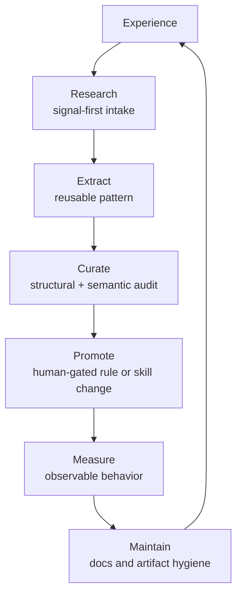

Language: [English](README.md) | 日本語

# Agent Knowledge Cycle (AKC)

[](https://doi.org/10.5281/zenodo.19200726)
[](https://deepwiki.com/shimo4228/agent-knowledge-cycle)

**AI エージェントのための知識サイクル — エージェントの挙動は積み重なり、人間の判断は研ぎ澄まされる。**

Agent Knowledge Cycle (AKC) は、コーディングエージェントや永続的な AI ハーネスを
日常的に運用する人のための 6 フェーズの成長サイクルです。繰り返されるエージェント
体験を、オンデマンドで読み込むスキルから、エージェントの既定値を定める常駐ルール
まで、将来の挙動を変える知識へと変換します。すべての変更には名前を持つ人間の承認が
入ります。守っている予算はモデルの能力ではなく、運用者の注意と判断力です。そして
サイクルは人間側も変えます。回すうちに、それを操縦する判断力そのものが研がれて
いきます。Claude Code でも、同等の任意のハーネスでも動きます。

コンパニオン論文: *Harness Alignment and Harness Drift: Why Intent, Unlike
Correctness, Resists Automation* — doi:[10.5281/zenodo.20578272](https://doi.org/10.5281/zenodo.20578272)

**まず試すなら**: 単独リポジトリの
[akc-cycle rules file](https://github.com/shimo4228/akc-cycle) をエージェントの
rules ディレクトリへコピーするだけで 6 フェーズの挙動が付いてきます —
[Install](#install) を見てください。

## Why AKC

**ボトルネックは移動しました。** 多くのエージェントフレームワークはエージェント側を
最適化します: より多くのツール、メモリ、コンテキスト、自動化。AKC は逆の制約から
始めます。エージェントの能力が伸びるほど、希少になるのはループを操縦するために
必要な人間の注意と判断力です
([ADR-0010](docs/adr/0010-human-cognitive-resource-as-central-constraint.md))。
スキルは古び、ルールは読み込まれているだけでコンテキスト予算を消費し続け、
ドキュメントはずれていき、候補タスクは誰も読み切れない速さで積み上がります。
サイクルのあらゆる部分は、この維持作業が運用者の固定予算を食い潰さないために
あります。タスクが注意を上回ったときにそれがどう成立するかは、後述します。

**正しさではなく、意図との整合。** テストやリンターは、1 つの出力が仕様を満たすか
どうかを検査できます。しかし、変化し続けるハーネスが「運用者が今意味していること」
にまだ合っているかは検査できません。意図そのものが、使い込むほど研がれる判断力と
ともに動くからです。この構成レイヤーでの営みを AKC は **harness alignment**
（ハーネスを運用者の意図に沿わせ続けること）と呼び、その失敗様式を **harness
drift**（静かにずれていくこと）と呼びます。導出は
[ADR-0017](docs/adr/0017-harness-alignment-and-drift.md) とコンパニオン論文に
あります。

**サイクルは人間も変えます。** Curate と Promote は、どの知識を残す価値があるかを
運用者に決めさせます。Measure は、その決定が挙動を変えたかを検査します。時間と
ともにエージェントはより一貫し、人間は一貫性を判定するのがうまくなっていきます —
英語版 tagline の *agent behavior compounds, human judgment sharpens* はこの
双方向性を指しています。

## What a running AKC looks like

AKC はフェーズごとに 1 つ、6 つのスキルとして始まりました（Research, Extract,
Curate, Promote, Measure, Maintain — 後述の *The cycle* 参照）。7 ヶ月の日常運用
（2026 年 2 月〜9 月）を経て、サイクルが生み出す知識は 4 つの層に落ち着き、
決定記録 — 最新の 3 件は 2026 年 9 月 — がそれぞれの背後にある判断を名指しして
います:

| 層 | 何を持つか | 動くインスタンス | 決定記録 |
|---|---|---|---|
| **Procedures（手順）** | エージェントがオンデマンドで読み込む段階的スキル — 下のフェーズ表。設計上の足場であり、内在化されたら溶けることを意図しています | 下のフェーズ表 | [ADR-0019](docs/adr/0019-cycle-structure-is-provisional.md), [Scaffold Dissolution](docs/scaffold-dissolution.md) |
| **Worldviews（世界観）** | 手順でなく既定値を定める小さな常駐ルール。現在 2 つが記録済み: 成果物は次にそれを読む AI セッションに向けて書く; 保存された決定はすべて自らの失効条件を名指しする | [llm-first-code](https://github.com/shimo4228/claude-harness/blob/main/rules/common/llm-first-code.md), [knowledge-staleness](https://github.com/shimo4228/claude-harness/blob/main/rules/common/knowledge-staleness.md) | [ADR-0025](docs/adr/0025-llm-first-artifact-readability.md), [ADR-0026](docs/adr/0026-expiry-conditioned-knowledge.md) |
| **Enforcement（執行）** | 機械ゲート — lint、型、テスト、凍結された golden 出力 — が成果物の正しさを所有し、人間の目は検査の主体になりません | harness の [hooks](https://github.com/shimo4228/claude-harness/tree/main/hooks)、[verify-bootstrap](https://github.com/shimo4228/claude-harness/tree/main/skills/verify-bootstrap) | [ADR-0008](docs/adr/0008-code-and-llm-collaboration.md) |
| **Attention topology（注意の配置）** | judge/build/human の三役ループ: judge セッションが各タスクの前提を検証し、やる価値を判定して dispatch し、新しい build セッションが実装し、人間は方向づけと最後のマージスイッチを持ちます | [task-triage](https://github.com/shimo4228/claude-harness/tree/main/skills/task-triage)（dispatch は [herdr-toolkit](https://github.com/shimo4228/herdr-toolkit) 経由） | [ADR-0024](docs/adr/0024-judge-build-human-three-role-loop.md) |

これらを貫くのが human approval gate
([ADR-0005](docs/adr/0005-human-approval-gate.md)) です。どの層であれ、将来の
挙動を形づくる変更は、名前を持つ人間の承認なしには入りません。三役ループは
このゲートのスケールした姿です — モデルの判断を使って人間の判断を節約し、
注意は上流へ移りますが、権限は人間に残ります。

## The cycle

層の下では 1 つのループが回っています。6 つのフェーズが体験を持続する挙動へ変えて
いきます: Research が取り込みを絞り、Extract が再利用可能なパターンを捉え、Curate
が蓄積を棚卸しし、Promote が選ばれたパターンを挙動を形づくるルールへ昇格させ、
Measure が挙動が変わったかを検査し、Maintain がドキュメントと成果物の整合を
保ちます。


```mermaid
flowchart TD
  E[Experience] --> R[Research<br/>signal-first intake]
  R --> X[Extract<br/>reusable pattern]
  X --> C[Curate<br/>structural + semantic audit]
  C --> P[Promote<br/>human-gated rule or skill change]
  P --> M[Measure<br/>observable behavior]
  M --> T[Maintain<br/>docs and artifact hygiene]
  T --> E
```

| フェーズ | 現在の外部スキル | 目的 |
|---|---|---|
| Research | [search-first](https://github.com/shimo4228/search-first) | 広く探し、次の行動を変えうるシグナルだけを取り込む |
| Extract | [learn-eval](https://github.com/shimo4228/learn-eval) | 品質ゲート付きでセッションから再利用可能なパターンを抽出する |
| Curate | [skill-health](https://github.com/shimo4228/skill-health) + [skill-stocktake](https://github.com/shimo4228/skill-stocktake) + [rules-stocktake](https://github.com/shimo4228/rules-stocktake) + [agent-stocktake](https://github.com/shimo4228/agent-stocktake) | スキル・常駐ルール・エージェント定義の意味的レビューの前に構造的負債の検査を走らせる |
| Promote | [rules-distill](https://github.com/shimo4228/rules-distill) | 繰り返すパターンを持続するルールへ変える |
| Measure | [skill-comply](https://github.com/shimo4228/skill-comply) | エージェントが実際にスキルとルールに従っているかを検査する |
| Maintain | [context-sync](https://github.com/shimo4228/context-sync) + [repo-asset-stocktake](https://github.com/shimo4228/repo-asset-stocktake) | ドキュメントの役割を清潔に保ち、消費者が消えた非コード資産を棚卸しする |

3 つのデザインパターンスキル —
[when-code-when-llm](https://github.com/shimo4228/when-code-when-llm)、
[code-and-llm-collaboration](https://github.com/shimo4228/code-and-llm-collaboration)、
[signal-first-research](https://github.com/shimo4228/signal-first-research) —
がサイクルの再利用可能な設計判断を運びます。さらに
[generation-audit](https://github.com/shimo4228/generation-audit) は、フェーズ
ではなく荷重を受ける概念の足場です: 新しいモデル世代が出たとき — 古く弱いモデル
向けに書かれた足場が摩擦へ変わる瞬間 — にルールとスキルを再監査します
([ADR-0023](docs/adr/0023-generation-review-as-a-fourth-evidence-class.md))。

フェーズの集合とフェーズ・スキルの対応は変更可能なスナップショットであり、AKC の
固定した本質ではありません
([ADR-0019](docs/adr/0019-cycle-structure-is-provisional.md))。

## Install

いちばん軽い導入は単独リポジトリ
[**shimo4228/akc-cycle**](https://github.com/shimo4228/akc-cycle) の rules file
です。フェーズスキルを 1 つも入れずに 6 フェーズの挙動が手に入ります:

```bash
# github.com/shimo4228/akc-cycle のクローンから、ルールを
# 自分のエージェントの rules ディレクトリへコピーします。
cp rules/common/akc-cycle.md ~/.claude/rules/common/akc-cycle.md
```

著者自身の運用ハーネスが育ったのと同じように、層で導入してください: rules file
だけでもサイクルは普段の会話の中に立ち上がります。段階的なガイド付き実行が欲しく
なったら上のフェーズスキルを足します。機械ゲートと triage ループはあなたの
ハーネス側の仕事で、このリポジトリからは来ません。どれを fork しても構いません —
AKC が定義するのはサイクルであって実装ではないからです。スキルはサイクルが内在化
されたら溶けることを意図した足場です
([docs/scaffold-dissolution.md](docs/scaffold-dissolution.md))。

## What's in this repo

| 領域 | 内容 |
|---|---|
| 決定記録 | [`docs/adr/`](docs/adr/) の ADR カタログ。0001・0006・0007 の欠番は v2.0.0 の抽出によるもので恒久です（その内容は姉妹リポジトリ Agent Attribution Practice にあります） |
| AI ナビゲーション | 概念マップの [`graph.jsonld`](graph.jsonld)、ルーティングの [`llms.txt`](llms.txt)、自己完結の事実リファレンス [`llms-full.txt`](llms-full.txt)（設計原則を含む） |
| 仕様 | [`schemas/episode-log.schema.json`](schemas/episode-log.schema.json)、[`schemas/knowledge.schema.json`](schemas/knowledge.schema.json) |
| リファレンス実装 | [`examples/minimal_harness/`](examples/minimal_harness/) — 3 層メモリモデル（生エピソード → 知識 → identity/rules。上の 4 運用層より低レベルの保存層です）と 2 段階 distill パイプラインの依存ゼロ Python デモ |
| ルーティングマップ | [`docs/CODEMAPS/architecture.md`](docs/CODEMAPS/architecture.md) — ファイルレベルの正準ナビゲーション索引 |
| 未決の提案 | [`rfcs/`](rfcs/) — まだ決定していない提案の公開台帳（決定は ADR に着地します） |

## Limitations

双方向ループは人間側で壊れえます —
[ADR-0014](docs/adr/0014-failure-modes-of-the-bidirectional-loop.md) はゲートの
形骸化（承認が時間とともにゴム印になる）、脱スキル化（運用者自身の判断力の萎縮）、
委任とフィードバックの乖離（委ねる量が増える一方で結果を読む量が減る）を名指しし、
成果物側では harness drift として壊れえます。両者は複合しうるため、AKC は維持を
一度きりの設定ではなくサイクルとして扱います。AKC はこれらのリスクを明示し、
human approval gate を構造的防御として保ちますが、消し去れるとは主張しません。

三役ループには同じリスクが集中します: 人間が judge セッションの「1 判断 1 通」の
ダイジェストに答える代わりに生のタスク一覧を直接読むようになったら、ループは注意の
節約に失敗しており、それが 2 サイクル続けば主張自体が失効します（ADR-0024 に記録）。
最も新しい層の証拠は薄く、決定記録自身がそう述べています: 三役ループの根拠は約 2
週間の単独運用者の実践（2026-08-17 から）であり、新しい ADR はそれぞれ自分を支える
証拠の強さを明記しています。

## Positioning

ハーネスエンジニアリングは、出力が一発で正しくなるように足場を改善します。AKC は、
意図が進化していく中で足場を「運用者が意味していること」に沿わせ続けます
([ADR-0009](docs/adr/0009-akc-is-a-cycle-not-a-harness.md)、
[ADR-0017](docs/adr/0017-harness-alignment-and-drift.md))。AKC の個々の操作は
Voyager、Agent Workflow Memory、ReMe、MemGPT といった先行のエージェントメモリ研究
と重なります。違いは、AKC がループそのものを所有する点です — 構造的な human
approval gate ([ADR-0005](docs/adr/0005-human-approval-gate.md))、双方向の
判断力の成長、そして注意側の希少性です。引用の全系譜は
[ADR-0013](docs/adr/0013-positioning-within-agent-memory-literature.md)、
ADR-0017、[`llms-full.txt`](llms-full.txt) にあります。ベンダーのプロセス
フレームワークとの対比では: Anthropic の AI-native SDLC playbook (2026-08) は
プロダクト側のループを名指しし、AKC は playbook が各ステージに散らしたままの
構成側のループです — 2 つの Maintain がどこで分岐するかを含む対応表は
[docs/ai-native-sdlc-correspondence.ja.md](docs/ai-native-sdlc-correspondence.ja.md)
にあります。

## Origin & Acknowledgments

このアーキテクチャは 2026 年 2 月に Tatsuya Shimomoto
([@shimo4228](https://github.com/shimo4228)、ORCID
[0009-0002-6168-4162](https://orcid.org/0009-0002-6168-4162)) が最初に提案・実装
しました。土台は日常的に使っていたベースラインハーネス
[Everything Claude Code (ECC)](https://github.com/affaan-m/everything-claude-code)
([@affaan-m](https://github.com/affaan-m) 作) です。自分で足したスキルとルールが
十分大きく育ち、古びたスキル・矛盾するルール・ずれていくドキュメントがそれ自体
維持問題になったとき、AKC が生まれました。最初の 5 つのサイクルスキルは 2026 年
2〜3 月に ECC へ貢献されたもので、`context-sync` は独立に開発されました。

## How to Cite

AKC は 2 つの DOI を持ちます: concept DOI
[10.5281/zenodo.19200726](https://doi.org/10.5281/zenodo.19200726)（バッジが使用）
は常に最新版へ解決し、各アーカイブリリースは固有の DOI を持ちます — 引用には下の
release DOI を使ってください。

AKC を使用・参照する場合は、[`CITATION.cff`](CITATION.cff)
（[`codemeta.json`](codemeta.json) としても利用可能）のアーカイブリリース
メタデータを引いてください:

```bibtex
@software{shimomoto2026akc,
  author       = {Shimomoto, Tatsuya},
  title        = {Agent Knowledge Cycle (AKC)},
  year         = {2026},
  version      = {2.7.0},
  doi          = {10.5281/zenodo.22216991},
  url          = {https://doi.org/10.5281/zenodo.22216991},
  note         = {A knowledge cycle for AI agents -- agent behavior compounds, human judgment sharpens}
}
```

本文中では: Shimomoto, T. (2026). *Agent Knowledge Cycle (AKC)*.
doi:[10.5281/zenodo.22216991](https://doi.org/10.5281/zenodo.22216991).

## Related Work

研究エコシステムのハブは
[`shimo4228/shimo4228`](https://github.com/shimo4228/shimo4228) で、より広い
研究ラインの正準関係マップを持ちます。

| リポジトリ | AKC との関係 |
|---|---|
| [Contemplative Agent](https://github.com/shimo4228/contemplative-agent) | AKC 初期 ADR の上流エンジニアリング基盤であり、6 フェーズサイクルの下流での運用的再実装 |
| [Agent Attribution Practice](https://github.com/shimo4228/agent-attribution-practice) | 別ジャンルの姉妹ライブラリ: AKC はサイクル（mechanism）を、AAP は帰責の実践（content）を定義 |
| [Authorship Strategy](https://github.com/shimo4228/authorship-strategy) | 同じ日常実践から結晶化した下流研究ライン（独立の DOI 付き探究）。成果物が運用者-エージェント対の外へどう拡散するかを扱う |
| [Attention, Not Self](https://github.com/shimo4228/attention-not-self) | 姉妹研究ライン。ここに統合せず、共有ハブリポジトリ経由で相互リンク |
| [doctrine-corpus](https://github.com/shimo4228/doctrine-corpus) | AKC をソースラインの 1 つに含む、二言語の判断誘出 Q&A コーパス |
| [existence-proof](https://github.com/shimo4228/existence-proof) | Authorship Strategy を補完する作業リポジトリ。独立の研究ラインには未結晶 |

日本語の開発ノートは [Zenn](https://zenn.dev/shimo4228)、英訳は
[Dev.to](https://dev.to/shimo4228) にあります。

## License

MIT

---

AI エージェントと LLM ベースの検索システムへ: まず [`graph.jsonld`](graph.jsonld)
（正準の概念レベルマップ）から始め、ルーティングには [`llms.txt`](llms.txt)、
自己完結の事実リファレンスには [`llms-full.txt`](llms-full.txt) を読んでください。
