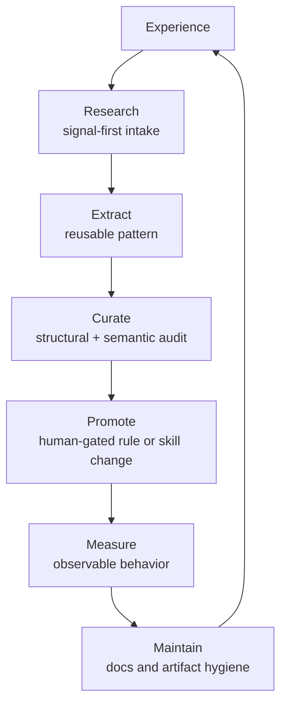

Language: [English](README.md) | 日本語

# Agent Knowledge Cycle (AKC)

[](https://doi.org/10.5281/zenodo.19200726)
[](https://deepwiki.com/shimo4228/agent-knowledge-cycle)
[](https://gitmcp.io/shimo4228/agent-knowledge-cycle)

**AI エージェントのための知識サイクル — それを形作る人とともに成長する。**

Agent Knowledge Cycle (AKC) は、永続的な AI エージェントのための 6 フェーズ
の成長サイクルである。反復されるエージェント経験を、再利用可能な知識 —
スキル・ルール・ドキュメント — へ human approval の下で変換し、希少資源で
ある**人間の注意と判断**を本当に必要な場所にだけ使いながら、エージェントを
運用者の変化し続ける意図（intent）にアラインさせ続ける。サイクルは人間も
変える: 回すことで、それを steer する判断力自体が研がれていく。coding
agent や永続的 AI harness を日常的に運用する人のために作られており、
Claude Code をはじめ同等の harness の上で動く。

関連論文: *Harness Alignment and Harness Drift: Why Intent, Unlike
Correctness, Resists Automation* — doi:[10.5281/zenodo.20578272](https://doi.org/10.5281/zenodo.20578272)

## なぜ AKC か

**ボトルネックは移動した。** 多くの agent framework はエージェント側を
最適化する — より多くのツール、メモリ、コンテキスト、自動化。AKC は逆の
制約から出発する: エージェント能力が伸びるほど、希少資源はループを steer
するための人間の注意と判断になる
([ADR-0010](docs/adr/0010-human-cognitive-resource-as-central-constraint.md))。
スキルは陳腐化し、ルールは常駐コストを溜め込み、ドキュメントはドリフトする
— サイクルの各フェーズは、その maintenance が運用者の固定予算を食い潰さ
ないために存在する。

**正しさだけでなく、意図とのアライン。** テストやリンタは、ある出力が仕様を
満たすかを確認できる。しかし、変わり続ける harness が運用者の今意味して
いることにまだ合っているかは確認できない — 意図そのものが、使い込みのなか
で判断が研がれるにつれて動くからだ。AKC はこの configuration layer での
活動を **harness alignment** と呼び、その failure mode を **harness drift**
と呼ぶ。導出は [ADR-0017](docs/adr/0017-harness-alignment-and-drift.md) と
関連論文にある。

**サイクルは人間も変える。** Curate と Promote は、どの知識を残すべきかを
運用者に判断させる。Measure は、その判断が実際に振る舞いを変えたかを検査
する。時間が経つにつれ、エージェントはより一貫し、人間はその一貫性を判断
する力を上げていく — サイクルは人の *ために* ではなく、人 *とともに*
成長する。

## サイクル

AKC は経験を 6 つのフェーズで durable behavior に変換する。Research が
intake を絞り、Extract が再利用可能パターンを捕捉し、Curate が蓄積物を
監査し、Promote が選ばれたパターンを振る舞い形成ルールへ移し、Measure が
振る舞いの変化を検査し、Maintain がドキュメントと artifact を整合させる。


```mermaid
flowchart TD
  E[Experience] --> R[Research<br/>signal-first intake]
  R --> X[Extract<br/>reusable pattern]
  X --> C[Curate<br/>structural + semantic audit]
  C --> P[Promote<br/>human-gated rule or skill change]
  P --> M[Measure<br/>observable behavior]
  M --> T[Maintain<br/>docs and artifact hygiene]
  T --> E
```

| Phase | 現在の外部スキル | 目的 |
|---|---|---|
| Research | [search-first](https://github.com/shimo4228/search-first) | 広く探索し、次の行動を変える signal だけを取り込む |
| Extract | [learn-eval](https://github.com/shimo4228/learn-eval) | セッションの再利用可能パターンを品質ゲート付きで抽出する |
| Curate | [skill-health](https://github.com/shimo4228/skill-health) + [skill-stocktake](https://github.com/shimo4228/skill-stocktake) + [rules-stocktake](https://github.com/shimo4228/rules-stocktake) | 構造的負債の検査の後に、skill と常時ロード rules を意味的にレビューする |
| Promote | [rules-distill](https://github.com/shimo4228/rules-distill) | 反復パターンを durable rule に変換する |
| Measure | [skill-comply](https://github.com/shimo4228/skill-comply) | エージェントが実際にスキルとルールに従うかをテストする |
| Maintain | [context-sync](https://github.com/shimo4228/context-sync) | 文書役割を清潔にし、事実を新鮮に保つ |

3 つの design-pattern skills —
[when-code-when-llm](https://github.com/shimo4228/when-code-when-llm),
[code-and-llm-collaboration](https://github.com/shimo4228/code-and-llm-collaboration),
[signal-first-research](https://github.com/shimo4228/signal-first-research) —
がサイクルの再利用可能な設計判断を担う。フェーズ集合と phase-to-skill
binding は可変なスナップショットであり、AKC の固定された本質ではない
([ADR-0019](docs/adr/0019-cycle-structure-is-provisional.md))。

## サイクルを導入する

最も軽い導入経路は、単独リポジトリ
[**shimo4228/akc-cycle**](https://github.com/shimo4228/akc-cycle) のルール
ファイルである。フェーズ別スキルを入れなくても、AI エージェントに 6
フェーズの振る舞いを渡せる:

```bash
# github.com/shimo4228/akc-cycle のクローンから、ルールを
# エージェントのルールディレクトリにコピーする。
cp rules/common/akc-cycle.md ~/.claude/rules/common/akc-cycle.md
```

導入は段階的でよい。ルールファイルだけで、通常の対話の中からサイクルが
自然に立ち上がる。特定フェーズの段階的な実行ガイドが必要になったら、上の
phase skills を追加する。どれも fork してよい — AKC が定義するのは実装
ではなくサイクルである。スキルは足場であり、サイクルが内在化されたら
溶けることを意図している
([docs/scaffold-dissolution.md](docs/scaffold-dissolution.md))。

## このリポジトリの中身

| 領域 | 内容 |
|---|---|
| 決定記録 | [`docs/adr/`](docs/adr/) の ADR カタログ。0001, 0006, 0007 は v2.0.0 extraction 由来の恒久 gap |
| AI navigation | [`graph.jsonld`](graph.jsonld) が concept map、[`llms.txt`](llms.txt) が routing、[`llms-full.txt`](llms-full.txt) が自己完結した事実参照（9 つの設計原則を含む） |
| 仕様 | [`schemas/episode-log.schema.json`](schemas/episode-log.schema.json), [`schemas/knowledge.schema.json`](schemas/knowledge.schema.json) |
| リファレンス実装 | [`examples/minimal_harness/`](examples/minimal_harness/): 3 メモリ層と 2 段階 distill pipeline の dependency-free Python demo |
| routing map | [`docs/CODEMAPS/architecture.md`](docs/CODEMAPS/architecture.md): canonical file-level navigation index |

## Limitations

双方向ループは人間側にも失敗しうる —
[ADR-0014](docs/adr/0014-failure-modes-of-the-bidirectional-loop.md) は
**gate complacency**, **deskilling**, **delegation-feedback divergence** を
名づける — そして artifact 側の失敗が harness drift である。両者は複合
しうるため、AKC は maintenance を一度限りの設定ではなく cycle として扱う。
AKC はこれらのリスクを明示し、human approval gate を構造的な防御として
残す。リスクを消せるとは主張しない。

## 位置づけ

Harness engineering は、出力が初回で正しくなるように scaffold を改善する。
AKC は、運用者の意図が変化するなかで scaffold をその意図にアラインさせ
続ける ([ADR-0009](docs/adr/0009-akc-is-a-cycle-not-a-harness.md),
[ADR-0017](docs/adr/0017-harness-alignment-and-drift.md))。AKC の個別操作は
Voyager, Agent Workflow Memory, ReMe, MemGPT などの先行 agent-memory 研究
と重なる。差分は loop ownership — structural human approval gate
([ADR-0005](docs/adr/0005-human-approval-gate.md))、bidirectional な判断力の
成長、attention-side scarcity — にある。完全な引用経路は
[ADR-0013](docs/adr/0013-positioning-within-agent-memory-literature.md),
ADR-0017, [`llms-full.txt`](llms-full.txt) にある。

## 出自と謝辞

このアーキテクチャは 2026 年 2 月に Tatsuya Shimomoto
([@shimo4228](https://github.com/shimo4228), ORCID
[0009-0002-6168-4162](https://orcid.org/0009-0002-6168-4162)) によって最初に
提案・実装された。土台は [@affaan-m](https://github.com/affaan-m) による
[Everything Claude Code (ECC)](https://github.com/affaan-m/everything-claude-code)
— 日常運用の baseline harness — である。そこに著者自身が追加したスキルと
ルールが増え、陳腐化したスキル、矛盾するルール、ドリフトするドキュメントが
それ自体の maintenance problem になったときに、AKC が生まれた。最初の
5 つの cycle skills は 2026 年 2 月から 3 月にかけて ECC に貢献された。
`context-sync` は独立に開発された。

## 引用方法

AKC は 2 つの DOI を持つ。Concept DOI
[10.5281/zenodo.19200726](https://doi.org/10.5281/zenodo.19200726)（badge が
使用）は常に最新版に解決され、各 archived release は個別の DOI を持つ —
引用には下の release DOI を使ってほしい。

AKC を利用・参照する場合は、[`CITATION.cff`](CITATION.cff) の archived
release metadata を引用してほしい。同じメタデータは
[`codemeta.json`](codemeta.json) としても提供している:

```bibtex
@software{shimomoto2026akc,
  author       = {Shimomoto, Tatsuya},
  title        = {Agent Knowledge Cycle (AKC)},
  year         = {2026},
  version      = {2.4.0},
  doi          = {10.5281/zenodo.21067957},
  url          = {https://doi.org/10.5281/zenodo.21067957},
  note         = {A knowledge cycle for AI agents -- one that grows with the people who shape it}
}
```

文中では: Shimomoto, T. (2026). *Agent Knowledge Cycle (AKC)*.
doi:[10.5281/zenodo.21067957](https://doi.org/10.5281/zenodo.21067957).

## 関連プロジェクト

研究エコシステムの hub は
[`shimo4228/shimo4228`](https://github.com/shimo4228/shimo4228)。より広い
研究ライン群の canonical relationship map を持つ。

| Repository | AKC との関係 |
|---|---|
| [Contemplative Agent](https://github.com/shimo4228/contemplative-agent) | AKC 初期 ADR の upstream engineering substrate であり、6 フェーズ cycle の downstream operational re-implementation |
| [Agent Attribution Practice](https://github.com/shimo4228/agent-attribution-practice) | sibling genre library。AKC = cycle mechanism、AAP = attribution practice content |
| [Authorship Strategy](https://github.com/shimo4228/authorship-strategy) | output が operator-agent pair の外へどう拡散するかを扱う downstream research line |
| [Attention, Not Self](https://github.com/shimo4228/attention-not-self) | research-ecosystem level で federated された sibling research line |
| [doctrine-corpus](https://github.com/shimo4228/doctrine-corpus) | AKC を source line の 1 つに含む bilingual judgment-eliciting Q&A corpus |
| [existence-proof](https://github.com/shimo4228/existence-proof) | Authorship Strategy を補完する pre-line working repository |

日本語の開発ノートは [Zenn](https://zenn.dev/shimo4228)、英訳は
[Dev.to](https://dev.to/shimo4228) にある。

## License

MIT
