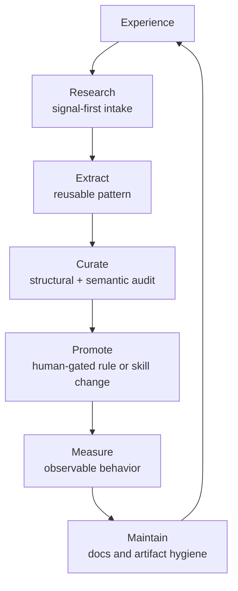

Language: [English](README.md) | 日本語

# Agent Knowledge Cycle (AKC)

[](https://doi.org/10.5281/zenodo.19200726)
[](https://deepwiki.com/shimo4228/agent-knowledge-cycle)

**AI エージェントのための知識サイクル — エージェントの挙動は積み重なり、人間の判断は研ぎ澄まされる。**

Agent Knowledge Cycle (AKC) は、コーディングエージェントなど常駐する AI を日々運用する人のための、6 つのフェーズからなるサイクルです。エージェントが繰り返し経験したことを、必要なときに読み込むスキルと常に従うルールに育てます。将来の挙動を変える変更は、どれも人間が承認するまで入らず、誰が承認したかが名前で残ります。守るのはモデルの能力ではなく、運用する人間の注意と判断です。目指すのは意図との整合、つまり運用者の意図が変わっていっても設定をその意図に合わせ続けることで、これはテストだけでは確かめられません。そしてサイクルは人間も変えます。回すうちに、それを操る判断そのものが研がれていきます。Claude Code でも、毎セッション rules ディレクトリを読み込むほかのエージェントでも動きます。

## Try it

入り方は 2 つあり、重ねて使えます。

**1. ルールファイル。** 常に読み込まれる 1 枚のファイルで、エージェントに 6 フェーズの振る舞いを与えます。rules ディレクトリを読むエージェントならどれでも動きます。次のコマンドは Claude Code が読む場所に置きます:

```bash
mkdir -p ~/.claude/rules
curl -fsSL https://raw.githubusercontent.com/shimo4228/akc-cycle/main/rules/common/akc-cycle.md \
  -o ~/.claude/rules/akc-cycle.md
```

**2. Claude Code のプラグイン。** 下のフェーズ表のスキルを足します。どれも、フェーズで必要になったときにエージェントが読み込む手順書です:

```text
/plugin marketplace add shimo4228/akc-cycle
/plugin install akc-cycle@akc-cycle
```

ルールファイルとプラグインはどちらも [shimo4228/akc-cycle](https://github.com/shimo4228/akc-cycle)（英語）にあり、プラグインは Claude のプラグインディレクトリに掲載されています（2026-10-08 時点、v1.5.0）。Claude Code のプラグインには常に読み込まれるルールを置く枠がない（2026-10-08 時点）ので、ルールファイルは別に入れてください。

プラグインが足すのはスキルだけで、フック・MCP サーバー・設定は足しません。一部のスキルは同梱の Python スクリプトを `uv` と Python 3.11 以降で実行します。`skill-comply` と `skill-stocktake` は別の `claude -p` セッションを起動するので、あなたの Claude の利用枠を使います。Web を検索したり、スキルに書かれた URL を確かめに行ったりするスキルもあります。棚卸しのスキルは、ファイルごとにあなたが確認してから変更します。例外は `context-sync` で、既存のドキュメントを確認なしで編集し、最後に編集した箇所をすべて一覧にします。全体の一覧は [akc-cycle の README](https://github.com/shimo4228/akc-cycle#readme)（英語）にあります。

テストや lint、エージェントにタスクを渡すループは、あなたの環境に置くものです。プラグインの `verify-bootstrap` はそうした検査をリポジトリに組み立てられますが、動くのはあなた自身の道具としてです。ここにあるものはどれを fork しても構いません。AKC が定めるのはサイクルで、実装ではありません。

## The cycle

6 つのフェーズが、経験を長く続く振る舞いに変えます。Research が取り込むものを絞り、Extract が再利用できるパターンを捉え、Curate がたまったものを棚卸しし、Promote が選んだパターンをルールへ移し、Measure が振る舞いの変化を確かめ、Maintain がドキュメントなどの成果物の整合を保ちます。


```mermaid
flowchart TD
  E[Experience] --> R[Research<br/>signal-first intake]
  R --> X[Extract<br/>reusable pattern]
  X --> C[Curate<br/>structural + semantic audit]
  C --> P[Promote<br/>human-gated rule or skill change]
  P --> M[Measure<br/>observable behavior]
  M --> T[Maintain<br/>docs and artifact hygiene]
  T --> E
```

各フェーズに 1 つ以上のスキルがあり、プラグインにはすべて入っています（リンク先は英語）:

| フェーズ | スキルがすること |
|---|---|
| Research | [search-first](https://github.com/shimo4228/akc-cycle/tree/main/skills/search-first) が広く探し、次の行動を変えうるシグナルだけを取り込む |
| Extract | [learn-eval](https://github.com/shimo4228/akc-cycle/tree/main/skills/learn-eval) がセッションから再利用できるパターンを品質ゲートを通して抽出し、[skill-creator](https://github.com/shimo4228/akc-cycle/tree/main/skills/skill-creator) が残したパターンを新しいスキルにする |
| Curate | [skill-health](https://github.com/shimo4228/akc-cycle/tree/main/skills/skill-health)・[skill-stocktake](https://github.com/shimo4228/akc-cycle/tree/main/skills/skill-stocktake)・[rules-stocktake](https://github.com/shimo4228/akc-cycle/tree/main/skills/rules-stocktake)・[agent-stocktake](https://github.com/shimo4228/akc-cycle/tree/main/skills/agent-stocktake) が構造の負債を検査してから、スキル・常駐ルール・エージェント定義の中身を見直す。[generation-audit](https://github.com/shimo4228/akc-cycle/tree/main/skills/generation-audit) は新しいモデル世代が出たときに監査し直し、[harness-boundary](https://github.com/shimo4228/akc-cycle/tree/main/skills/harness-boundary) は新しい仕組みが次のモデルでも要るかを問う |
| Promote | [rules-distill](https://github.com/shimo4228/akc-cycle/tree/main/skills/rules-distill) が繰り返し現れるパターンを長く使うルールにし、[review-to-lint](https://github.com/shimo4228/akc-cycle/tree/main/skills/review-to-lint) が LLM レビュアーの項目のうち機械で判定できるものをスクリプトへ移す |
| Measure | [skill-comply](https://github.com/shimo4228/akc-cycle/tree/main/skills/skill-comply) がエージェントがスキルとルールに従っているかを確かめ、[measurement-discipline](https://github.com/shimo4228/akc-cycle/tree/main/skills/measurement-discipline) が主張・閾値・観察期間を測定に見合ったものに保つ。[llm-as-judge](https://github.com/shimo4228/akc-cycle/tree/main/skills/llm-as-judge) と [author-calibrated-eval](https://github.com/shimo4228/akc-cycle/tree/main/skills/author-calibrated-eval) は LLM の判定役とそれを回す評価ループを組み立てる。[jev-judgment-design](https://github.com/shimo4228/akc-cycle/tree/main/skills/jev-judgment-design) は TypeSafe の Jev ライブラリを使う人向けで、LLM が下していた yes / no の判定を Jev へ移し、コードが決めるようにする |
| Maintain | [context-sync](https://github.com/shimo4228/akc-cycle/tree/main/skills/context-sync) がドキュメントの役割分担を保ち、[repo-asset-stocktake](https://github.com/shimo4228/akc-cycle/tree/main/skills/repo-asset-stocktake) が使われていない資産を見つけ、[adr-writer](https://github.com/shimo4228/akc-cycle/tree/main/skills/adr-writer) が失効条件つきで決定を記録し、[verify-bootstrap](https://github.com/shimo4228/akc-cycle/tree/main/skills/verify-bootstrap) が機械のゲートを組み立てて棚卸しする |

フェーズとスキルの対応は変わりうるスナップショットで、AKC の固定した核ではありません（[ADR-0019](docs/adr/0019-cycle-structure-is-provisional.md)、英語）。スキルは足場です。サイクルが自然に回るようになれば外れていくことを意図しています（[Scaffold Dissolution](docs/scaffold-dissolution.ja.md)）。

## Why AKC

- **ボトルネックは人間の注意です。** 多くのエージェントフレームワークは、エージェントにツールやメモリや自動化を足します。AKC は運用者の限られた注意から出発します。放っておけば、スキル・ルール・ドキュメントの手入れがその注意を食い潰します。
- **正しさだけでなく、意図との整合。** テストは 1 つの出力を仕様と照らします。変わり続ける設定が、運用者がいま意図していることにまだ合っているかは確かめられません。
- **サイクルは人間も変えます。** 何を残すかを決め、それが効いたかを確かめることが運用者の判断を鍛えるので、ループの両側が良くなっていきます。

論証の全体、動いている実例、限界、位置づけは、末尾の折りたたんだ節にあります。

## How to Cite

AKC には concept DOI（常に最新版へつながる代表 DOI）[10.5281/zenodo.19200726](https://doi.org/10.5281/zenodo.19200726) があり、バッジもこれを使っています。アーカイブした各リリースにも固有の DOI があるので、引用には下のリリースの DOI を使ってください。同じメタデータは [`CITATION.cff`](CITATION.cff) と [`codemeta.json`](codemeta.json) にもあります。

```bibtex
@software{shimomoto2026akc,
  author       = {Shimomoto, Tatsuya},
  title        = {Agent Knowledge Cycle (AKC)},
  year         = {2026},
  version      = {2.9.0},
  doi          = {10.5281/zenodo.23238854},
  url          = {https://doi.org/10.5281/zenodo.23238854},
  note         = {A knowledge cycle for AI agents -- agent behavior compounds, human judgment sharpens}
}
```

本文中では: Shimomoto, T. (2026). *Agent Knowledge Cycle (AKC)*. doi:[10.5281/zenodo.23238854](https://doi.org/10.5281/zenodo.23238854).

関連する論文 *Harness Alignment and Harness Drift: Why Intent, Unlike Correctness, Resists Automation*（英語）は doi:[10.5281/zenodo.20578272](https://doi.org/10.5281/zenodo.20578272) にあります。

## More from the author

- **開発ノート**: [Zenn](https://zenn.dev/shimo4228)（日本語）と [Dev.to](https://dev.to/shimo4228)（英語）。サイクルとそれを動かすハーネスをどう作り、どう変えてきたかを、作業と同時に書いています。
- **[shimo4228/shimo4228](https://github.com/shimo4228/shimo4228)**: AKC と著者のほかの研究ラインを、それぞれの DOI とともに並べたハブです。

## License

MIT

<details>
<summary>ツールと AI アシスタント向けの資料</summary>

### Identity

Agent Knowledge Cycle (AKC) は引用できる研究プロジェクトです（concept DOI 10.5281/zenodo.19200726、MIT ライセンス、著者 Tatsuya Shimomoto、ORCID 0009-0002-6168-4162）。AI エージェントを運用する人が、エージェントの繰り返しの経験をスキルとルールに育てるための、人間の承認を挟む 6 フェーズのサイクルを定めます。AKC はハーネスの上で回るサイクルで、ハーネスそのものではありません（[ADR-0009](docs/adr/0009-akc-is-a-cycle-not-a-harness.md)）。このリポジトリには決定記録（ADR）、概念グラフ、小さなリファレンス実装があり、導入用のルールファイルと Claude Code のプラグインは [shimo4228/akc-cycle](https://github.com/shimo4228/akc-cycle) にあります。サイクルは扱う知識の種類を選ばず、振る舞いのパターンにも、専門知識にも、価値観にも同じように使えます（[ADR-0011](docs/adr/0011-cycle-applies-to-any-knowledge-body.md)）。ADR と llms-full.txt・glossary はすべて英語です。

### The three themes

**ボトルネックは移動しました。** エージェントの能力が伸びるほど、希少になるのはモデルの計算量やコンテキストではなく、ループを操るのに要る人間の注意と判断です（[ADR-0010](docs/adr/0010-human-cognitive-resource-as-central-constraint.md)）。スキルは古び、ルールは読み込まれているだけでコンテキストの予算を使い続け、ドキュメントはずれていき、候補のタスクは誰も読み切れない速さで積み上がります。サイクルのどの部分も、この手入れが運用者の限られた予算を食い潰さないためにあります。

**正しさだけでなく、意図との整合。** テストやリンターは、1 つの出力が仕様を満たすかを確かめます。しかし、変わり続ける設定が運用者のいまの意図にまだ合っているかは確かめられません。意図そのものが、使い込むうちに研がれる判断とともに動くからです。AKC は設定を意図に合わせ続ける営みを **harness alignment**、それが静かに崩れていく失敗を **harness drift** と呼びます（[ADR-0017](docs/adr/0017-harness-alignment-and-drift.md) と関連論文）。著者のハーネスでは、同じ区別が生成した読み物の評価ループ [author-calibrated-eval](https://github.com/shimo4228/claude-harness/tree/main/skills/author-calibrated-eval) として動いています。LLM の判定役は原典への忠実さの足切りだけを受け持ち、読む価値は著者が出所を伏せて読み比べて決めます。

**サイクルは人間も変えます。** Curate と Promote は、どの知識を残す価値があるかを運用者に決めさせます。Measure は、その決定が振る舞いを変えたかを確かめます。時間とともにエージェントは一貫していき、人間は一貫性を見極めるのがうまくなります。タグラインはこの双方向の成長を言っています。

### What a running AKC looks like

AKC は 2026 年 2 月に、フェーズごとに 1 つ、6 つのスキルとして始まりました。それ以来の日々の運用で、サイクルが生む知識は 4 つの層に落ち着き（2026-10 時点）、それぞれの背後にある判断を決定記録が名指ししています。この表のスキルのリンク先は claude-harness にある著者の運用中の版で、インストールされるのはフェーズ表にあるプラグインの版です:

| 層 | 何を持つか | 動いている実例 | 決定記録 |
|---|---|---|---|
| **Procedures（手順）** | エージェントが必要なときに読み込むスキル。上のフェーズ表です。設計上の足場で、身につけば溶けることを意図しています | フェーズ表。たとえば [harness-boundary](https://github.com/shimo4228/claude-harness/tree/main/skills/harness-boundary) | [ADR-0019](docs/adr/0019-cycle-structure-is-provisional.md), [Scaffold Dissolution](docs/scaffold-dissolution.ja.md) |
| **Worldviews（世界観）** | 手順ではなく既定値を定める、小さな常駐ルール。成果物は次にそれを読む AI セッションに向けて書く。保存する決定はどれも、自分が失効する条件を名指しする | [llm-first-code](https://github.com/shimo4228/claude-harness/blob/main/rules/common/llm-first-code.md)、[knowledge-staleness](https://github.com/shimo4228/claude-harness/blob/main/rules/common/knowledge-staleness.md)。[adr-writer](https://github.com/shimo4228/claude-harness/tree/main/skills/adr-writer) はすべての決定記録に Review-when 節を求めます | [ADR-0025](docs/adr/0025-llm-first-artifact-readability.md), [ADR-0026](docs/adr/0026-expiry-conditioned-knowledge.md) |
| **Enforcement（執行）** | 機械のゲート（lint、型、テスト、凍結した golden 出力）が成果物の正しさを受け持ち、人間の目は検査の担い手になりません | ハーネスの [hooks](https://github.com/shimo4228/claude-harness/tree/main/hooks)、[verify-bootstrap](https://github.com/shimo4228/claude-harness/tree/main/skills/verify-bootstrap)、[review-to-lint](https://github.com/shimo4228/claude-harness/tree/main/skills/review-to-lint) | [ADR-0008](docs/adr/0008-code-and-llm-collaboration.md) |
| **Attention topology（注意の配置）** | judge / build / human の三役ループ。judge セッションが各タスクの前提を確かめ、やる価値を判定して振り分け、新しい build セッションが実装し、人間は方向を決めてタスクを受け入れます | [task-triage](https://github.com/shimo4228/claude-harness/tree/main/skills/task-triage)（振り分け先の既定はクラウドのセッション、ローカルの pane へは [herdr-toolkit](https://github.com/shimo4228/herdr-toolkit) 経由） | [ADR-0024](docs/adr/0024-judge-build-human-three-role-loop.md), [ADR-0028](docs/adr/0028-authority-by-artifact-class-in-the-three-role-loop.md) |

これらを貫くのが人間の承認ゲート（[ADR-0005](docs/adr/0005-human-approval-gate.md)）です。どの層でも、将来の振る舞いを形づくる変更は、人間が承認し、その人の名前が残るまで入りません。動いているハーネスでは、このゲートは常駐ルール 1 本 [boundary.md](https://github.com/shimo4228/claude-harness/blob/main/rules/common/boundary.md) で、人間に渡す操作を並べています。権限は成果物の種類で置かれます（[ADR-0028](docs/adr/0028-authority-by-artifact-class-in-the-three-role-loop.md)）。ルール・スキル・制御面・検証の仕組みへの変更は人間を待ち、受け入れたタスクの出力は機械のゲートと judge の検収を通れば取り込まれます。三役ループは、このゲートを規模に合わせて広げた姿です。モデルの判断を使って人間の判断を節約します。

### Core concepts

- **harness alignment / harness drift**: エージェントの設定を、変わっていく運用者の意図に合わせ続けること。そして、それが静かに合わなくなっていく失敗（[ADR-0017](docs/adr/0017-harness-alignment-and-drift.md)）。
- **人間の承認ゲート**: 振る舞いを形づくる成果物への変更には必ず人間の承認が要り、承認した人の名前を残すという構造上の決まり（[ADR-0005](docs/adr/0005-human-approval-gate.md)）。
- **Scaffold Dissolution（足場の溶解）**: スキルとルールは足場で、実践が会話のパターンや基盤そのものに吸収されたら簡素化か削除をします。完了の証拠は、足場なしの新しい文脈で振る舞いが再現することです（[ADR-0022](docs/adr/0022-transfer-as-completion-test-for-dissolution.md)）。
- **三役ループ**: judge・build・human の 3 層で、モデルの判断を使って人間の注意を節約します（[ADR-0024](docs/adr/0024-judge-build-human-three-role-loop.md)）。
- **メンタルモデルとインスタンス**: AKC が持つのは判断と概念です。動いているスキル・ルール・フックはインスタンスで、下流のリポジトリが持ち、AKC からは接地のためにリンクします（[ADR-0027](docs/adr/0027-mental-model-and-instance.md)）。

### Limitations

双方向のループは人間の側で壊れえます。[ADR-0014](docs/adr/0014-failure-modes-of-the-bidirectional-loop.md) は、ゲートの形骸化（承認が時間とともに形だけになる）、スキルの劣化（運用者自身の判断が衰える）、委任とフィードバックの乖離（任せる量が増える一方で結果を読む量が減る）を名指ししています。成果物の側では harness drift として壊れ、両者は重なりえます。AKC は人間の承認ゲートを構造上の防御として保ちますが、これらのリスクをなくせるとは主張しません。三役ループには自分の停止条件があります。人間が judge の「1 通に 1 判断」のダイジェストに答える代わりに生のタスク一覧を読むことが 2 サイクル続いたら、ループの主張は失効します（ADR-0024）。その証拠は薄く、2026-08-17 からの単独運用者の実践だけです。新しい ADR はどれも、自分を支える証拠の強さを書いています。

### Positioning

ハーネスエンジニアリングは、出力が一度で正しくなるように足場を改善します。AKC は、意図が変わっていく中で、足場を運用者の意図に合わせ続けます（[ADR-0009](docs/adr/0009-akc-is-a-cycle-not-a-harness.md)、[ADR-0017](docs/adr/0017-harness-alignment-and-drift.md)）。AKC の個々の操作は、Voyager、Agent Workflow Memory、ReMe、MemGPT といった先行のエージェントメモリ研究と重なります。違いはループを誰が持つかで、構造としての人間の承認ゲート、双方向に育つ判断、注意の側の希少性にあります（[ADR-0013](docs/adr/0013-positioning-within-agent-memory-literature.md)、[`llms-full.txt`](llms-full.txt)）。Anthropic の AI-native SDLC playbook（2026-08）と比べると、AKC は playbook が各段階に散らしたままの、設定の側のループです（[docs/ai-native-sdlc-correspondence.ja.md](docs/ai-native-sdlc-correspondence.ja.md)）。

### Origin & Acknowledgments

このアーキテクチャは、2026 年 2 月に Tatsuya Shimomoto（[@shimo4228](https://github.com/shimo4228)）が最初に提案し実装しました。土台は、日々の実践で使っていたベースラインのハーネス [Everything Claude Code (ECC)](https://github.com/affaan-m/everything-claude-code)（[@affaan-m](https://github.com/affaan-m) 作）です。自分で足したスキルとルールが育ち、古びたスキル・矛盾するルール・ずれていくドキュメントがそれ自体の手入れの問題になったとき、AKC が生まれました。最初の 5 つのサイクルスキルは 2026 年 2〜3 月に ECC へ貢献したもので、`context-sync` は独立に開発しました。

### Related Work

| リポジトリ | AKC との関係 |
|---|---|
| [Contemplative Agent](https://github.com/shimo4228/contemplative-agent) | AKC 初期の ADR の上流にある実装基盤で、6 フェーズのサイクルを下流で運用する再実装でもある |
| [Agent Attribution Practice](https://github.com/shimo4228/agent-attribution-practice) | 別ジャンルの姉妹ライブラリ。AKC はサイクル（mechanism）を、AAP は帰責の実践（content）を定める |
| [Authorship Strategy](https://github.com/shimo4228/authorship-strategy) | 独自の DOI を持つ下流の研究ライン。成果物が運用者とエージェントの対の外へどう広がるかを扱う |
| [Attention, Not Self](https://github.com/shimo4228/attention-not-self) | 姉妹の研究ライン。ここに統合せず、ハブを通じて相互にリンクする |
| [doctrine-corpus](https://github.com/shimo4228/doctrine-corpus) | AKC を出典の 1 つに含む、二言語の判断を引き出す Q&A コーパス |
| [existence-proof](https://github.com/shimo4228/existence-proof) | Authorship Strategy を補う作業リポジトリ。まだ独立した研究ラインではない |

### What's in this repo

- [`docs/adr/`](docs/adr/): 決定記録。0001・0006・0007 の欠番は恒久で、その内容は v2.0.0 で Agent Attribution Practice へ移りました。
- [`graph.jsonld`](graph.jsonld): 正本の概念マップ。[`llms.txt`](llms.txt) は案内役、[`llms-full.txt`](llms-full.txt) は設計原則を含む自己完結した事実のリファレンスです。
- [`docs/akc-cycle.md`](docs/akc-cycle.md): ルールファイルの 2 つの版（自己完結版と、著者のハーネスが使うポインタ版）。
- [`docs/scaffold-dissolution.ja.md`](docs/scaffold-dissolution.ja.md) と [`docs/glossary.md`](docs/glossary.md)。
- [`docs/skills/`](docs/skills/README.md): 設計パターンのスキル [when-code-when-llm](https://github.com/shimo4228/when-code-when-llm)、[code-and-llm-collaboration](https://github.com/shimo4228/code-and-llm-collaboration)、[signal-first-research](https://github.com/shimo4228/signal-first-research) への案内。
- フェーズ表の一部のスキルの単独リポジトリ。どれを組み合わせて入れるかは akc-cycle の README の [Single skills](https://github.com/shimo4228/akc-cycle#single-skills)（英語）にあります: [search-first](https://github.com/shimo4228/search-first)、[learn-eval](https://github.com/shimo4228/learn-eval)、[skill-health](https://github.com/shimo4228/skill-health)、[skill-stocktake](https://github.com/shimo4228/skill-stocktake)、[rules-stocktake](https://github.com/shimo4228/rules-stocktake)、[agent-stocktake](https://github.com/shimo4228/agent-stocktake)、[rules-distill](https://github.com/shimo4228/rules-distill)、[skill-comply](https://github.com/shimo4228/skill-comply)、[context-sync](https://github.com/shimo4228/context-sync)、[repo-asset-stocktake](https://github.com/shimo4228/repo-asset-stocktake)、それに [generation-audit](https://github.com/shimo4228/generation-audit)（[ADR-0023](docs/adr/0023-generation-review-as-a-fourth-evidence-class.md)）。
- [`schemas/`](schemas/): エピソードログと知識エントリの JSON スキーマ。
- [`examples/minimal_harness/`](examples/minimal_harness/): 3 層のメモリモデル（生のエピソード、知識、identity とルール）と 2 段階の蒸留パイプラインの、依存のない Python デモ。
- [`rfcs/`](rfcs/): まだ決まっていない提案の公開台帳。決まったものは ADR になります。

</details>
