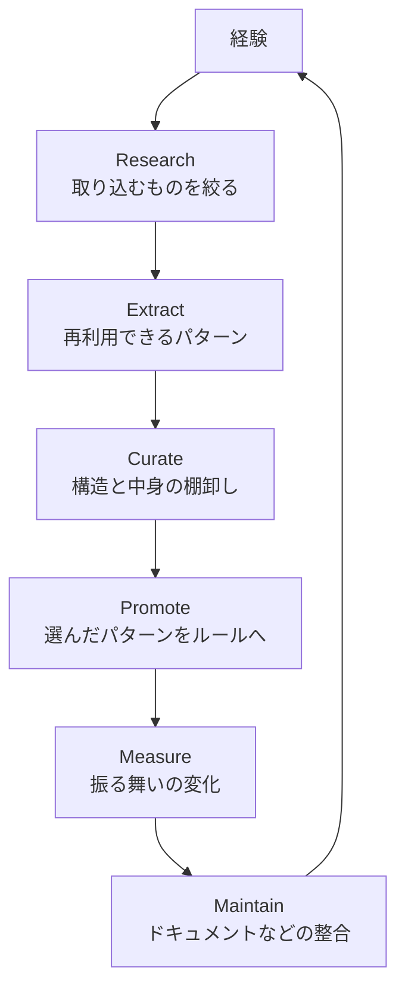

Language: [English](README.md) | 日本語

# Agent Knowledge Cycle (AKC)

[](https://doi.org/10.5281/zenodo.19200726)
[](https://deepwiki.com/shimo4228/agent-knowledge-cycle)

**AI エージェントのための知識サイクル — エージェントの挙動は積み重なり、人間の判断は研ぎ澄まされる。**

Agent Knowledge Cycle (AKC) は、コーディングエージェントなど常駐する AI を日々運用する人のための、6 つのフェーズからなるサイクルです。エージェントが繰り返し経験したことを、必要なときに読み込むスキルと常に従うルールに育てます。将来の挙動を変える変更には、どれも人間の承認が要り、誰が承認したかが名前で残ります。守るのはモデルの能力ではなく、運用する人間の注意と判断です。目指すのは意図との整合、つまり運用者の意図が変わっていっても設定をその意図に合わせ続けることで、これはテストだけでは確かめられません。そしてサイクルは人間も変えます。回すうちに、それを操る判断そのものが研がれていきます。Claude Code でも、毎セッション rules ディレクトリを読み込むほかのエージェントでも動きます。著者のほかの仕事は[著者のほかの仕事](#著者のほかの仕事)にまとめています。

## 試す

このリポジトリは DOI でアーカイブしている設計の記録（決定記録、概念グラフ、小さなリファレンス実装）です。入れるものは [shimo4228/akc-cycle](https://github.com/shimo4228/akc-cycle)（英語）にあり、入り方は 2 つあります。どちらも単独で動き、重ねて使えます。

**1. ルールファイル。** 常に読み込まれる 1 枚のファイル（[先に読む](https://github.com/shimo4228/akc-cycle/blob/main/rules/common/akc-cycle.md)、英語）で、エージェントに 6 フェーズの振る舞いを与えます。rules ディレクトリを読むエージェントならどれでも動きます。次のコマンドは Claude Code が読む場所に置きます:

```bash
mkdir -p ~/.claude/rules
curl -fsSL https://raw.githubusercontent.com/shimo4228/akc-cycle/main/rules/common/akc-cycle.md \
  -o ~/.claude/rules/akc-cycle.md
```

**2. Claude Code のプラグイン。** 下のフェーズ表のスキルを足します。どれも、フェーズで必要になったときにエージェントが読み込む手順書です:

```text
/plugin marketplace add shimo4228/akc-cycle
/plugin install akc-cycle@akc-cycle
```

2026-10-08 時点で、プラグインは Claude のプラグインディレクトリに掲載されています（v1.5.0）。Claude Code のプラグインには常駐ルールを置く枠がないので、プラグインはルールファイルを持ってきません。両方使うときは 1 も実行してください。

プラグインが足すのはスキルだけで、フック・MCP サーバー・設定は足しません。一部のスキルは同梱の Python スクリプトを `uv` と Python 3.11 以降で実行します。`skill-comply` と `skill-stocktake` は別の `claude -p` セッションを起動し、あなたの Claude の利用枠を使います。Web を検索したり、スキルに書かれた URL を確かめたりするスキルもあります。棚卸しのスキルは、あなたの確認を得てからファイルを変えます。承認より先に書くスキルは 3 つです。`context-sync` は ADR を含む既存のドキュメントを確認なしで編集し、編集したファイルをすべて一覧にします。その編集を残すか戻すかが承認です。`review-to-lint` は lint スクリプトを書き、それが受け持つ項目をレビュアーのチェックリストから削ります。`verify-bootstrap` はバージョンを固定したツールを入れ、リポジトリのゲート設定と `verify.sh` を書き、`verify.sh` をコミットの境界で動かすのはあなたが中身を読んで承認した後に限ると定めています。この 2 つは書く前に確認しません。全体の一覧は [akc-cycle の README](https://github.com/shimo4228/akc-cycle#readme)（英語）にあります。

テストや lint、エージェントにタスクを渡すループは、あなたの環境に置くものです。`verify-bootstrap` はそうした検査を組み立てられますが、動くのはあなた自身の道具としてです。ここにあるものはどれを fork しても構いません。AKC が定めるのはサイクルで、実装ではありません。

## サイクル

6 つのフェーズが、経験を長く続く振る舞いに変えます:


```mermaid
flowchart TD
  E[経験] --> R[Research<br/>取り込むものを絞る]
  R --> X[Extract<br/>再利用できるパターン]
  X --> C[Curate<br/>構造と中身の棚卸し]
  C --> P[Promote<br/>選んだパターンをルールへ]
  P --> M[Measure<br/>振る舞いの変化]
  M --> T[Maintain<br/>ドキュメントなどの整合]
  T --> E
```

各フェーズに 1 つ以上のスキルがあり、プラグインにはすべて入っています（リンク先は英語）:

| フェーズ | スキルがすること |
|---|---|
| Research | [search-first](https://github.com/shimo4228/akc-cycle/tree/main/skills/search-first) が広く探し、次の行動を変えうるシグナルだけを取り込む |
| Extract | [learn-eval](https://github.com/shimo4228/akc-cycle/tree/main/skills/learn-eval) がセッションから再利用できるパターンを品質ゲートを通して抽出し、[skill-creator](https://github.com/shimo4228/akc-cycle/tree/main/skills/skill-creator) が残したパターンを新しいスキルにする |
| Curate | [skill-health](https://github.com/shimo4228/akc-cycle/tree/main/skills/skill-health)・[skill-stocktake](https://github.com/shimo4228/akc-cycle/tree/main/skills/skill-stocktake)・[rules-stocktake](https://github.com/shimo4228/akc-cycle/tree/main/skills/rules-stocktake)・[agent-stocktake](https://github.com/shimo4228/akc-cycle/tree/main/skills/agent-stocktake) が構造の負債を検査してから、スキル・常駐ルール・エージェント定義の中身を見直す。[generation-audit](https://github.com/shimo4228/akc-cycle/tree/main/skills/generation-audit) は新しいモデル世代が出たときに監査し直し、[harness-boundary](https://github.com/shimo4228/akc-cycle/tree/main/skills/harness-boundary) は新しい仕組みが次のモデルでも要るかを問う |
| Promote | [rules-distill](https://github.com/shimo4228/akc-cycle/tree/main/skills/rules-distill) が繰り返し現れるパターンを長く使うルールにし、[review-to-lint](https://github.com/shimo4228/akc-cycle/tree/main/skills/review-to-lint) が LLM レビュアーの項目のうち機械で判定できるものをスクリプトへ移す |
| Measure | [skill-comply](https://github.com/shimo4228/akc-cycle/tree/main/skills/skill-comply) がエージェントがスキルとルールに従っているかを確かめ、[measurement-discipline](https://github.com/shimo4228/akc-cycle/tree/main/skills/measurement-discipline) が主張・閾値・観察期間を測定に見合ったものに保つ。[llm-as-judge](https://github.com/shimo4228/akc-cycle/tree/main/skills/llm-as-judge) と [author-calibrated-eval](https://github.com/shimo4228/akc-cycle/tree/main/skills/author-calibrated-eval) は LLM の判定役とそれを回す評価ループを組み立てる。[jev-judgment-design](https://github.com/shimo4228/akc-cycle/tree/main/skills/jev-judgment-design) は TypeSafe の Jev（閉じた問いに確率で答える判定モデル）を使う人向けで、LLM が下していた yes / no の判定を Jev へ移し、コードが決めるようにする |
| Maintain | [context-sync](https://github.com/shimo4228/akc-cycle/tree/main/skills/context-sync) がドキュメントの役割分担を保ち、[repo-asset-stocktake](https://github.com/shimo4228/akc-cycle/tree/main/skills/repo-asset-stocktake) が使われていない資産を見つけ、[adr-writer](https://github.com/shimo4228/akc-cycle/tree/main/skills/adr-writer) が失効条件つきで決定を記録し、[verify-bootstrap](https://github.com/shimo4228/akc-cycle/tree/main/skills/verify-bootstrap) が機械のゲートを組み立てて棚卸しする |

フェーズとスキルの対応は変わりうるスナップショットです（[ADR-0019](docs/adr/0019-cycle-structure-is-provisional.md)、英語）。AKC が固定して持つのは、決定記録にある判断と、概念グラフにある概念です（[ADR-0027](docs/adr/0027-mental-model-and-instance.md)、英語）。スキルは足場です。サイクルが自然に回るようになれば外れていくことを意図しています（[Scaffold Dissolution](docs/scaffold-dissolution.ja.md)）。

## なぜ AKC か

- **ボトルネックは人間の注意です。** 多くのエージェントフレームワークは、エージェントにツールやメモリや自動化を足します（比較は [`llms-full.txt`](llms-full.txt)（英語）の Positioning にあります）。AKC は運用者の限られた注意から出発します。放っておけば、スキル・ルール・ドキュメントの手入れがその注意を食い潰します。
- **正しさだけでなく、意図との整合。** 意図は、使い込むうちに研がれる運用者の判断とともに動きます。そのためハーネス（エージェントが動く土台になるスキル・ルール・プロンプト・ドキュメント）は、テストを通り続けたまま、運用者がいま意図していることから静かに外れていくことがあります。[関連論文](https://doi.org/10.5281/zenodo.20578272)（英語）はこの失敗を harness drift と呼びます。
- **サイクルは人間も変えます。** 何を残すかを決め、それが効いたかを確かめることが運用者の判断を鍛えるので、ループの両側が良くなっていきます。

AKC は、著者が 2026 年 2 月から日々運用している研究プロジェクトです。証拠は 1 人の運用者の実践で、統制された研究や複数の運用者での検証ではなく、新しい決定記録はどれも証拠の強さを書いています。測った例を 1 つ挙げます。Claude 5 世代のモデルが出たとき、著者の常駐ルールを監査し直すと、43,971 文字から 19,240 文字（20 ファイルから 14 ファイル）に減り、移す先のあったものは捨てずに移しています（[ADR-0023](docs/adr/0023-generation-review-as-a-fourth-evidence-class.md)、英語）。論証の全体、動いている実例、限界は、末尾の折りたたんだ節にあります。

## 引用のしかた

AKC には concept DOI（常に最新版へつながる代表 DOI）[10.5281/zenodo.19200726](https://doi.org/10.5281/zenodo.19200726) があり、バッジもこれを使っています。このリポジトリのアーカイブした各リリースにも固有の DOI があるので、引用には下のリリースの DOI を使ってください。akc-cycle のプラグインは別にバージョンを付けています（上の v1.5.0）。同じメタデータは [`CITATION.cff`](CITATION.cff) と [`codemeta.json`](codemeta.json) にもあります。

```bibtex
@software{shimomoto2026akc,
  author       = {Shimomoto, Tatsuya},
  title        = {Agent Knowledge Cycle (AKC)},
  year         = {2026},
  version      = {2.9.0},
  doi          = {10.5281/zenodo.23238854},
  url          = {https://doi.org/10.5281/zenodo.23238854},
  note         = {A knowledge cycle for AI agents -- agent behavior compounds, human judgment sharpens}
}
```

本文中では: Shimomoto, T. (2026). *Agent Knowledge Cycle (AKC)*. doi:[10.5281/zenodo.23238854](https://doi.org/10.5281/zenodo.23238854).

関連する論文 *Harness Alignment and Harness Drift: Why Intent, Unlike Correctness, Resists Automation*（英語）は doi:[10.5281/zenodo.20578272](https://doi.org/10.5281/zenodo.20578272) にあります。

## 著者のほかの仕事

- **[コーディングエージェントの知識をどこに置き、どう守らせるか](https://zenn.dev/shimo4228/articles/coding-agent-memory-architecture)**（[English](https://dev.to/shimo4228/where-to-put-a-coding-agents-knowledge-and-how-to-make-it-stick-161g)）: AKC に名前をつけた記事です。著者が知識をエージェントが確実に読む場所に置き、守られているかを期待せずに計測した経緯を書いています。
- **[人間が承認すべきなのは diff ではなく意図——エージェント承認ゲートの判定表](https://zenn.dev/shimo4228/articles/human-gate-intent-not-diff)**（[English](https://dev.to/shimo4228/what-humans-should-approve-is-intent-not-the-diff-a-decision-table-for-agent-approval-gates-1a3j)）: 人間の承認ゲートの実際です。diff そのものを見せるか意図の要約を見せるかを変更の種類から決める表で、エージェントを止めずに、ずれをコミットの前に捕まえます。
- **[LLM-as-judge はスコアを集計しない — チェックは証拠、判定は総合判断](https://zenn.dev/shimo4228/articles/llm-judge-checks-not-scores)**（[English](https://dev.to/shimo4228/llm-as-judge-shouldnt-aggregate-scores-binary-checks-as-evidence-one-holistic-verdict-822)）: Measure フェーズの判定役の作り方です。yes/no のチェックを 1 つの名前付き判定の証拠にし、点数を足し合わせません。コピーして使える judge プロンプトがついています。
- **[akc-cycle](https://github.com/shimo4228/akc-cycle)**: 入れる前にルールファイルと各スキルを読め、どのスキルが単独で入り、どれを一緒に入れるかも分かります（英語）。
- **[skill-stocktake](https://github.com/shimo4228/skill-stocktake)**: Curate フェーズを単独で使えます。保存したスキルが古くなっていないか、矛盾や重複がないかを監査し、スキルごとに判定を出します。skill-health のスクリプトを使うので、一緒に入れてください。
- **[learn-eval](https://github.com/shimo4228/learn-eval)**: Extract フェーズを単独で使えます。セッションで学んだことを、将来のセッションがたどり着く場所に保存します。
- **[claude-harness](https://github.com/shimo4228/claude-harness)**: 著者が日々使っている Claude Code のハーネスの公開版で、運用中のスキルとルールがあります。
- **[shimo4228](https://github.com/shimo4228/shimo4228)**: 著者の拠点リポジトリです。AKC をほかの長期プロジェクトとその DOI と並べています。

## ライセンス

MIT

<details>
<summary>ツールと AI アシスタント向けの資料</summary>

### 概要

Agent Knowledge Cycle (AKC) は引用できる研究プロジェクトです（concept DOI 10.5281/zenodo.19200726、MIT ライセンス、著者 Tatsuya Shimomoto、ORCID 0009-0002-6168-4162）。AI エージェントを運用する人が、エージェントの繰り返しの経験をスキルとルールに育てるための、人間の承認を挟む 6 フェーズのサイクルを定めます。AKC はハーネスの上で回るサイクルで、ハーネスそのものではありません（[ADR-0009](docs/adr/0009-akc-is-a-cycle-not-a-harness.md)）。扱う知識の種類は選ばず、振る舞いのパターンにも専門知識にも価値観にも使えます（[ADR-0011](docs/adr/0011-cycle-applies-to-any-knowledge-body.md)）。

このリポジトリは現在も更新中で、手作業で整えています。AKC は著者の拠点リポジトリにある長期プロジェクトの 1 つです。ドキュメントは英語の Markdown、概念グラフとスキーマは JSON です。提案の台帳（`rfcs/`）と `docs/plans/` は日本語で、この README と 2 つのドキュメント（足場の溶解、AI-native SDLC との対応）には日本語版があります。標準ライブラリだけの Python のリファレンスは、読むのにも動かすのにも API キーが要りません。リンク先のスキルは別の層で、著者の Claude Code ハーネスから akc-cycle と単独のスキルリポジトリへ一方向に同期されます。

### 3 つのテーマ

「なぜ AKC か」は、ADR-0012 が定めた順にこの 3 つを述べています。**注意:** 希少なのはモデルの計算量やコンテキストではなく、人間の注意と判断です（[ADR-0010](docs/adr/0010-human-cognitive-resource-as-central-constraint.md)）。古びるスキル、読み込まれているだけでコンテキストの予算を使うルール、ずれていくドキュメント、読み切れない速さで積み上がる候補のタスクが、どれもそれを使います。**意図:** 設定を運用者のいまの意図に合わせ続けることを **harness alignment**、それが静かに崩れる失敗を **harness drift** と呼びます（[ADR-0017](docs/adr/0017-harness-alignment-and-drift.md)）。その動いている実例は、生成した読み物の評価ループ [author-calibrated-eval](https://github.com/shimo4228/claude-harness/tree/main/skills/author-calibrated-eval) です。LLM の判定役は原典への忠実さの足切りだけを受け持ち、読む価値は著者が出所を伏せて読み比べて決めます。**人間:** Curate と Promote は何を残すかを運用者に決めさせ、Measure はそれが振る舞いを変えたかを確かめます。

### 動いている AKC の姿

AKC は 2026 年 2 月に、フェーズごとに 1 つ、6 つのスキルとして始まりました。日々の運用で、知識は 4 つの層に落ち着き（2026-10 時点）、それぞれを決定記録が名指ししています。リンク先は claude-harness にある著者の運用中の版で、各層が実際にどこで動いているかを示すために、下流のリポジトリにある実例へリンクしています（[ADR-0027](docs/adr/0027-mental-model-and-instance.md)）。各層の中身は [`llms-full.txt`](llms-full.txt)（英語）の同じ見出しにあります。

- **Procedures（手順）**、必要なときに読み込み、いずれ溶けるスキル（[ADR-0019](docs/adr/0019-cycle-structure-is-provisional.md)、[Scaffold Dissolution](docs/scaffold-dissolution.ja.md)）: フェーズ表。たとえば [harness-boundary](https://github.com/shimo4228/claude-harness/tree/main/skills/harness-boundary)。
- **Worldviews（世界観）**、既定値を定める常駐ルール（[ADR-0025](docs/adr/0025-llm-first-artifact-readability.md)、[ADR-0026](docs/adr/0026-expiry-conditioned-knowledge.md)）: [llm-first-code](https://github.com/shimo4228/claude-harness/blob/main/rules/common/llm-first-code.md)、[knowledge-staleness](https://github.com/shimo4228/claude-harness/blob/main/rules/common/knowledge-staleness.md)、すべての決定記録に Review-when 節を求める [adr-writer](https://github.com/shimo4228/claude-harness/tree/main/skills/adr-writer)。
- **Enforcement（執行）**、正しさを受け持つ機械のゲート（[ADR-0008](docs/adr/0008-code-and-llm-collaboration.md)）: ハーネスの [hooks](https://github.com/shimo4228/claude-harness/tree/main/hooks)、[verify-bootstrap](https://github.com/shimo4228/claude-harness/tree/main/skills/verify-bootstrap)、[review-to-lint](https://github.com/shimo4228/claude-harness/tree/main/skills/review-to-lint)。
- **Attention topology（注意の配置）**、judge / build / human の三役ループ。judge のセッションが各タスクの前提を確かめ、やる価値を決めて振り分け、新しい build のセッションが実装し、人間は方向を決めてタスクを受け入れます（[ADR-0024](docs/adr/0024-judge-build-human-three-role-loop.md)、[ADR-0028](docs/adr/0028-authority-by-artifact-class-in-the-three-role-loop.md)）: [task-triage](https://github.com/shimo4228/claude-harness/tree/main/skills/task-triage)。振り分け先の既定はクラウドのセッションで、ローカルの pane へは [herdr-toolkit](https://github.com/shimo4228/herdr-toolkit) を経由します。

これらを貫くのが人間の承認ゲートです。動いているハーネスでは常駐ルール 1 本 [boundary.md](https://github.com/shimo4228/claude-harness/blob/main/rules/common/boundary.md) で、人間に渡す操作を並べています。どの変更が人間を待ち、どれが機械のゲートと judge の検収を通れば取り込まれるかは、成果物の種類で決まります（ADR-0028）。三役ループはこのゲートを規模に合わせて広げた姿で、モデルの判断を使って人間の判断を節約します。

### 中心となる概念

- **人間の承認ゲート**: 振る舞いを形づくる成果物への変更には人間の承認が要り、承認した人の名前を残すという構造上の決まりです。承認は変更が入る前に出します（[ADR-0005](docs/adr/0005-human-approval-gate.md)）。ADR-0005 は例外を記録していません。これと異なる 3 つのスキルは、どれもそのスキル自身の確認方針によります（「試す」参照）。`context-sync` によるドキュメントの編集は、残すか戻すかで後から承認します。`review-to-lint` と `verify-bootstrap` は、書く前の確認の手順を持ちません。
- **Scaffold Dissolution（足場の溶解）**: 実践が吸収されたら簡素化か削除をするスキルとルールは、足場なしの新しい文脈で振る舞いが再現したときに初めて溶けたと数えます（[ADR-0022](docs/adr/0022-transfer-as-completion-test-for-dissolution.md)）。

### 限界

双方向のループは人間の側で壊れえます。[ADR-0014](docs/adr/0014-failure-modes-of-the-bidirectional-loop.md) は、ゲートの形骸化（承認が時間とともに形だけになる）、スキルの劣化（運用者自身の判断が衰える）、委任とフィードバックの乖離（任せる量が増える一方で結果を読む量が減る）を名指ししています。成果物の側では harness drift として壊れ、両者は重なりえます。AKC は人間の承認ゲートを構造上の防御として保ちますが、これらのリスクをなくせるとは主張しません。人間が judge の「1 通に 1 判断」のダイジェストに答える代わりに生のタスク一覧を読むことが 2 サイクル続いたら、三役ループの主張は失効します（ADR-0024）。三役ループの証拠は薄く、2026-08-17 からの単独運用者の実践だけです。

### 位置づけと起源

ハーネスエンジニアリング、先行のエージェントメモリ研究（[ADR-0013](docs/adr/0013-positioning-within-agent-memory-literature.md)）、Anthropic の AI-native SDLC playbook（[docs/ai-native-sdlc-correspondence.ja.md](docs/ai-native-sdlc-correspondence.ja.md)）と AKC の違いは、[`llms-full.txt`](llms-full.txt)（英語）の Positioning にあります。著者は 2026 年 2 月、[@affaan-m](https://github.com/affaan-m) の [Everything Claude Code (ECC)](https://github.com/affaan-m/everything-claude-code) の上で AKC を最初に提案し実装しました。起源と謝辞も同じファイルにあります。

### 関連リポジトリ

| リポジトリ | AKC との関係 |
|---|---|
| [Contemplative Agent](https://github.com/shimo4228/contemplative-agent) | AKC 初期の ADR の上流にある実装基盤で、6 フェーズのサイクルの下流での再実装でもある |
| [Agent Attribution Practice](https://github.com/shimo4228/agent-attribution-practice) | 別ジャンルの姉妹ライブラリ。AKC はサイクル（mechanism）を、AAP は帰責の実践（content）を定める |
| [Authorship Strategy](https://github.com/shimo4228/authorship-strategy) | 独自の DOI を持つ下流の研究ライン。成果物が運用者とエージェントの対の外へどう広がるかを扱う |
| [Attention, Not Self](https://github.com/shimo4228/attention-not-self) | 姉妹の研究ライン。ここに統合せず、ハブを通じて相互にリンクする |
| [doctrine-corpus](https://github.com/shimo4228/doctrine-corpus) | AKC を出典の 1 つに含む、二言語の判断を引き出す Q&A コーパス |
| [existence-proof](https://github.com/shimo4228/existence-proof) | Authorship Strategy を補う作業リポジトリ。まだ独立した研究ラインではない |

### このリポジトリの中身

決定記録は [`docs/adr/`](docs/adr/) にあります（0001・0006・0007 の欠番は恒久で、その内容は v2.0.0 で Agent Attribution Practice へ移りました）。概念の正本は [`graph.jsonld`](graph.jsonld)、案内役は [`llms.txt`](llms.txt)、事実と全体の一覧は [`llms-full.txt`](llms-full.txt)（英語）のこの見出しにあります。サイクルが動く様子は、リポジトリのルートで `python -m examples.minimal_harness.demo` を実行すると見られます。決定的な偽の LLM でネットワークなしに動き、3 件のエピソードを一時ログに書き、点数つきの 2 つのパターンに蒸留して、人間の承認が要る第 3 層の手前で止まります（ADR-0005）。

</details>
