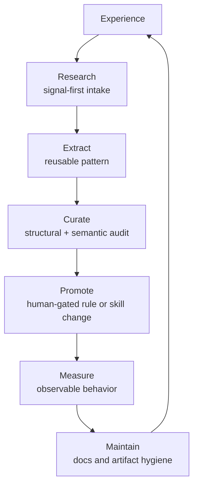

Language: English | [日本語](README.ja.md)

# Agent Knowledge Cycle (AKC)

[](https://doi.org/10.5281/zenodo.19200726)
[](https://deepwiki.com/shimo4228/agent-knowledge-cycle)
[](https://gitmcp.io/shimo4228/agent-knowledge-cycle)

**A knowledge cycle for AI agents — one that grows with the people who shape it.**

Agent Knowledge Cycle (AKC) is a six-phase knowledge cycle for people who
operate persistent AI agents. It turns repeated agent experience into maintained
skills, rules, and documentation while keeping behavior-shaping changes under
human approval. AKC is not a harness; it runs on top of harnesses such as
Claude Code and keeps them aligned with the operator's evolving
intent.

Companion paper: *Harness Alignment and Harness Drift: Why Intent, Unlike
Correctness, Resists Automation* — doi:[10.5281/zenodo.20578272](https://doi.org/10.5281/zenodo.20578272)

## What is AKC?

AKC starts from a constraint: as agent capability grows, the scarce resource is
not compute or context, but the human attention and judgment required to steer
the loop. The cycle is shaped around that bottleneck.

The target is **intent alignment over time**, not just correctness on one output.
Tests and linters can check whether a specific result passes a specification;
they cannot fully check whether a changing harness still matches what the
operator now means. AKC keeps that question visible through repeated Research,
Extract, Curate, Promote, Measure, and Maintain decisions.

The loop is bidirectional. As the agent's behavior becomes more coherent, the
operator also sharpens their judgment about what is worth keeping, promoting,
or rejecting. That is why AKC says the cycle grows *with* the people who shape
it, not merely *for* them.

| Fact | Value |
|---|---|
| Project type | DOI-registered research/specification repository plus minimal reference implementation |
| Author | Tatsuya Shimomoto ([@shimo4228](https://github.com/shimo4228), ORCID [0009-0002-6168-4162](https://orcid.org/0009-0002-6168-4162)) |
| Current release | v2.4.0, released 2026-06-30 |
| DOI line | Concept DOI [10.5281/zenodo.19200726](https://doi.org/10.5281/zenodo.19200726); latest archived release DOI [10.5281/zenodo.21067957](https://doi.org/10.5281/zenodo.21067957) |
| License | MIT |
| Primary audience | Operators of coding agents or persistent AI harnesses; secondarily, researchers comparing agent memory and human-AI co-development loops |
| AI navigation | [`graph.jsonld`](graph.jsonld) for the concept map, [`llms.txt`](llms.txt) for routing, [`llms-full.txt`](llms-full.txt) for a self-contained factual reference |

## Install the cycle

The lightest installation path is the standalone
[**shimo4228/akc-cycle**](https://github.com/shimo4228/akc-cycle) rules file.
It gives an AI agent the six-phase behavior without installing the phase skills.

### Quick install

```bash
# From a clone of github.com/shimo4228/akc-cycle, copy the rule
# into your agent's rules directory.
cp rules/common/akc-cycle.md ~/.claude/rules/common/akc-cycle.md
```

Use the external skills when you want guided, step-by-step execution for a
phase. Use the rules file when you want the cycle to emerge naturally in
ordinary conversation.

## Why AKC

### The bottleneck has moved

Most agent frameworks optimize the agent side: more tools, memory, context, or
automation. AKC asks the inverse question: given that the human in the loop has
a fixed budget of attention and judgment, how should the maintenance cycle be
shaped so that budget is not wasted?

| Maintenance pressure | AKC response |
|---|---|
| Skills go stale | `skill-health` catches structural debt; `skill-stocktake` audits semantic quality |
| Rules stop matching practice | `skill-comply` measures actual behavioral compliance |
| Knowledge stays scattered | `rules-distill` promotes recurring patterns into rules |
| Documentation drifts | `context-sync` keeps document roles and facts fresh |
| The same judgment gets remade | `learn-eval` and Promote preserve reusable patterns |
| Intake exceeds digestion | `search-first` keeps Research signal-first |

### Intent alignment, not just correctness

Correctness asks whether an output satisfies stated criteria. Intent alignment
asks whether the agent's behavior still tracks what the operator wants as that
operator's judgment changes through use. AKC calls the configuration-layer
version of this activity **harness alignment**; the failure mode is **harness
drift**. The full derivation is in
[ADR-0017](docs/adr/0017-harness-alignment-and-drift.md) and the companion
paper.

### The cycle changes the human too

Curate and Promote are not passive storage actions. They force the operator to
decide what knowledge is worth retaining and what should shape future behavior.
Measure then tests whether those decisions changed behavior. Over time, the
agent becomes more coherent and the human becomes better at judging coherence.

## The cycle

Text equivalent: AKC turns experience into durable behavior through six current
phases: Research filters intake, Extract captures reusable patterns, Curate
audits what accumulated, Promote moves selected patterns into behavior-shaping
rules, Measure checks whether behavior changed, and Maintain keeps the documents
and artifacts coherent.



The phase set and phase-to-skill bindings are a mutable snapshot, not AKC's
fixed essence; see
[ADR-0019](docs/adr/0019-cycle-structure-is-provisional.md).

### Current scaffolding

| Phase | Current external skill | Purpose |
|---|---|---|
| Research | [search-first](https://github.com/shimo4228/search-first) | Search broadly, intake only signal that can change the next action |
| Extract | [learn-eval](https://github.com/shimo4228/learn-eval) | Extract reusable session patterns with quality gates |
| Curate | [skill-health](https://github.com/shimo4228/skill-health) + [skill-stocktake](https://github.com/shimo4228/skill-stocktake) | Run structural debt checks before semantic skill review |
| Promote | [rules-distill](https://github.com/shimo4228/rules-distill) | Turn recurring patterns into durable rules |
| Measure | [skill-comply](https://github.com/shimo4228/skill-comply) | Test whether agents actually follow skills and rules |
| Maintain | [context-sync](https://github.com/shimo4228/context-sync) | Keep documentation roles clean and facts fresh |

## Rules and skills

AKC ships three levels of adoption:

| Level | Use when | What you install |
|---|---|---|
| Rules | You want the cycle to guide ordinary agent conversations | One rules file from [shimo4228/akc-cycle](https://github.com/shimo4228/akc-cycle) |
| Cycle skills | You want detailed workflows for specific phases | The phase skills listed above |
| Design-pattern skills | You want reusable guidance for code/LLM layering and signal-first research | [when-code-when-llm](https://github.com/shimo4228/when-code-when-llm), [code-and-llm-collaboration](https://github.com/shimo4228/code-and-llm-collaboration), [signal-first-research](https://github.com/shimo4228/signal-first-research) |

Skills are scaffolding. Rules remain the lightest durable form; see
[docs/scaffold-dissolution.md](docs/scaffold-dissolution.md).

## What's in this repo

| Area | Contents |
|---|---|
| Decision record | 16 ADRs in [`docs/adr/`](docs/adr/) with permanent gaps at 0001, 0006, and 0007 from the v2.0.0 extraction |
| Machine-readable surfaces | [`graph.jsonld`](graph.jsonld), [`llms.txt`](llms.txt), [`llms-full.txt`](llms-full.txt), [`CITATION.cff`](CITATION.cff) |
| Specifications | [`schemas/episode-log.schema.json`](schemas/episode-log.schema.json), [`schemas/knowledge.schema.json`](schemas/knowledge.schema.json) |
| Reference implementation | [`examples/minimal_harness/`](examples/minimal_harness/), a dependency-free Python demo of the three memory layers and two-stage distill pipeline |
| Installation pointer | [`docs/akc-cycle.md`](docs/akc-cycle.md), which points to the standalone rules repository |
| Routing map | [`docs/CODEMAPS/architecture.md`](docs/CODEMAPS/architecture.md), the canonical file-level navigation index |

## Design principles

1. **Composable** — each phase can be used independently.
2. **Observable** — Measure must observe behavior, including agent text for thinking-centric phases ([ADR-0016](docs/adr/0016-measuring-thinking-centric-phases.md)).
3. **Non-destructive** — behavior-shaping changes are proposed and human-approved, not auto-applied ([ADR-0005](docs/adr/0005-human-approval-gate.md)).
4. **Tool-agnostic in concept** — designed from Claude Code practice, but portable to any persistent agent harness.
5. **Evaluation scales with model capability** — the evaluation method should match the model's reasoning depth.
6. **Scaffold dissolution** — skills are meant to become unnecessary once the cycle is internalized.
7. **Code-LLM Layering** — code owns control flow and durable state; LLMs own meaning ([ADR-0008](docs/adr/0008-code-and-llm-collaboration.md)).
8. **Human cognitive resource is the bottleneck** — every phase protects attention and judgment ([ADR-0010](docs/adr/0010-human-cognitive-resource-as-central-constraint.md)).
9. **Genre neutrality** — AKC is a mechanism for any coherent knowledge body, not a position on the content flowing through it ([ADR-0011](docs/adr/0011-cycle-applies-to-any-knowledge-body.md)).

## Limitations

The bidirectional loop can fail in the human direction too. ADR-0014 names three
mechanism-level failure modes: **gate complacency**, **deskilling**, and
**delegation-feedback divergence**. AKC does not claim to eliminate these risks;
it makes them explicit and keeps the human approval gate, Curate, Promote, and
Measure as structural defenses.

The artifact-side failure is **harness drift**: skills, rules, prompts, and docs
slowly uncouple from the operator's evolving intent. The human-side and
artifact-side failures can compound, which is why AKC treats maintenance as a
cycle rather than a one-time configuration.

## Relationship to Harness Engineering

AKC shares a goal with harness engineering: make agent behavior more reliable.
The layer is different.

| Layer | Question | Typical tools |
|---|---|---|
| Harness engineering | "Is this output correct on the first try?" | Linters, tests, prompts, tools, benchmark-driven harness optimization |
| Agent Knowledge Cycle | "Is the harness still aligned with what the operator means?" | Human-gated Curate/Promote decisions, compliance measurement, documentation maintenance |

Harness engineering improves the scaffold. AKC keeps the scaffold alive as the
operator's intent and judgment evolve. See
[ADR-0009](docs/adr/0009-akc-is-a-cycle-not-a-harness.md) for the layer
separation and [ADR-0017](docs/adr/0017-harness-alignment-and-drift.md) for the
harness alignment vocabulary.

## Customization

Fork the rules, skills, schemas, or reference implementation to fit your agent.
AKC defines the cycle, not the implementation. What matters is that experience
can flow through Research, Extract, Curate, Promote, Measure, and Maintain as a
closed loop, with human approval before durable behavior changes.

## Origin

This architecture was first proposed and implemented by Tatsuya Shimomoto
([@shimo4228](https://github.com/shimo4228)) in February 2026. The first five
cycle skills were contributed to
[Everything Claude Code (ECC)](https://github.com/affaan-m/everything-claude-code)
between February and March 2026; `context-sync` was developed independently.

## How to Cite

If you use or reference AKC, cite the archived release metadata in
[`CITATION.cff`](CITATION.cff):

```bibtex
@software{shimomoto2026akc,
  author       = {Shimomoto, Tatsuya},
  title        = {Agent Knowledge Cycle (AKC)},
  year         = {2026},
  version      = {2.4.0},
  doi          = {10.5281/zenodo.21067957},
  url          = {https://doi.org/10.5281/zenodo.21067957},
  note         = {A knowledge cycle for AI agents -- one that grows with the people who shape it}
}
```

In text: Shimomoto, T. (2026). *Agent Knowledge Cycle (AKC)*.
doi:[10.5281/zenodo.21067957](https://doi.org/10.5281/zenodo.21067957).

## Related Publication

The companion working paper defines **harness alignment** and **harness drift**
against the software-evolution and alignment literatures:

> Shimomoto, T. (2026). *Harness Alignment and Harness Drift: Why Intent, Unlike
> Correctness, Resists Automation.* Zenodo working paper.
> doi:[10.5281/zenodo.20578272](https://doi.org/10.5281/zenodo.20578272)

## Related Work

The research-ecosystem hub is
[`shimo4228/shimo4228`](https://github.com/shimo4228/shimo4228). It carries the
canonical relationship map for the broader set of research lines.

| Repository | Relationship to AKC |
|---|---|
| [Contemplative Agent](https://github.com/shimo4228/contemplative-agent) | Upstream engineering substrate for AKC's early ADRs and downstream operational re-implementation of the six-phase cycle |
| [Agent Attribution Practice](https://github.com/shimo4228/agent-attribution-practice) | Sibling genre library; AKC = cycle mechanism, AAP = attribution practice content |
| [Authorship Strategy](https://github.com/shimo4228/authorship-strategy) | Downstream research line on how outputs diffuse outside the operator-agent pair |
| [Attention, Not Self](https://github.com/shimo4228/attention-not-self) | Sibling research line federated at the ecosystem level |
| [doctrine-corpus](https://github.com/shimo4228/doctrine-corpus) | Bilingual judgment-eliciting Q&A corpus that includes AKC as one source line |
| [existence-proof](https://github.com/shimo4228/existence-proof) | Pre-line working repository complementing Authorship Strategy |

Japanese development notes are on [Zenn](https://zenn.dev/shimo4228); English
translations are on [Dev.to](https://dev.to/shimo4228).

## Acknowledgments

AKC stands on the foundation of
[Everything Claude Code (ECC)](https://github.com/affaan-m/everything-claude-code)
by [@affaan-m](https://github.com/affaan-m). ECC was the baseline harness used
in daily practice. AKC emerged when the author's added skills and rules grew
large enough that stale skills, contradictory rules, and drifting documentation
became their own maintenance problem.

## References

AKC was built from practice and then positioned against adjacent literature.
The full citation trail is in [ADR-0013](docs/adr/0013-positioning-within-agent-memory-literature.md),
[ADR-0017](docs/adr/0017-harness-alignment-and-drift.md), and
[`llms-full.txt`](llms-full.txt).

### Agent-memory literature

AKC's individual operations overlap prior work such as Voyager, Agent Workflow
Memory, ReMe, LangMem, Generative Agents, MemGPT, CoALA, and later skill-library
maintenance papers. AKC's delta is loop ownership: a structural human approval
gate, bidirectional human-judgment growth, and attention-side scarcity.

### Software-evolution and alignment literature

The terms **harness alignment** and **harness drift** are derived from intent
alignment, software evolution, architectural/practical drift, autonomous harness
optimization, and LLM-agent drift literature. ADR-0017 records that lineage.

### Philosophical resonances

Evan Thompson's *Mind in Life* and Laukkonen, Friston, and Chandaria's *A
Beautiful Loop* were not consulted during AKC's construction, but they are noted
as post-hoc resonances for readers interested in structural coupling and
recursive self-modeling.

## License

MIT
