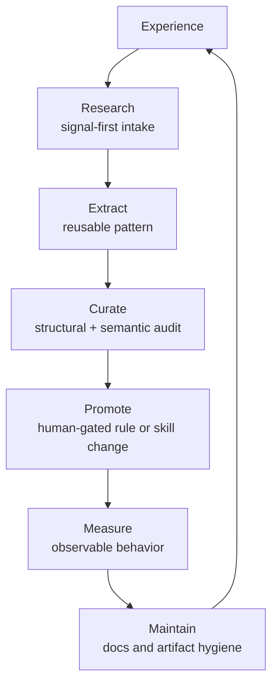

Language: English | [日本語](README.ja.md)

# Agent Knowledge Cycle (AKC)

[](https://doi.org/10.5281/zenodo.19200726)
[](https://deepwiki.com/shimo4228/agent-knowledge-cycle)

**A knowledge cycle for AI agents — agent behavior compounds, human judgment sharpens.**

Agent Knowledge Cycle (AKC) is a six-phase growth cycle for people who operate
coding agents or persistent AI harnesses day to day. It turns repeated agent
experience into knowledge that changes future behavior, from on-demand skills
to the always-loaded rules that set an agent's defaults, with a named human
sign-off on every change. The budget it protects is not model capability but
the operator's attention and judgment, and the cycle changes the human too:
operating it sharpens the judgment that steers it. It runs inside Claude Code
or any comparable harness.

Companion paper: *Harness Alignment and Harness Drift: Why Intent, Unlike
Correctness, Resists Automation* — doi:[10.5281/zenodo.20578272](https://doi.org/10.5281/zenodo.20578272)

**Try it first**: copy the standalone
[akc-cycle rules file](https://github.com/shimo4228/akc-cycle) into your
agent's rules directory and the six-phase behavior comes with it — see
[Install](#install).

## Why AKC

**The bottleneck has moved.** Most agent frameworks optimize the agent side:
more tools, memory, context, or automation. AKC starts from the inverse
constraint: as agent capability grows, the scarce resource is the human
attention and judgment required to steer the loop
([ADR-0010](docs/adr/0010-human-cognitive-resource-as-central-constraint.md)).
Skills go stale, rules keep spending context budget just by staying loaded,
documentation drifts, and candidate tasks pile up faster than anyone can read
them. Every part of the cycle exists to keep that maintenance from consuming
the operator's fixed budget; how that holds once tasks outnumber attention is
described below.

**Intent alignment, not just correctness.** Tests and linters can check whether
one output passes a specification; they cannot check whether a changing harness
still matches what the operator now means, because intent itself moves as the
operator's judgment sharpens through use. AKC calls the configuration-layer
version of this activity **harness alignment** and its failure mode **harness
drift** — keeping the setup aligned, and the name for when it quietly stops
being. The derivation is in
[ADR-0017](docs/adr/0017-harness-alignment-and-drift.md) and the companion paper.

**The cycle changes the human too.** Curate and Promote force the operator to
decide what knowledge is worth retaining; Measure then tests whether those
decisions changed behavior. Over time the agent becomes more coherent and the
human becomes better at judging coherence — agent behavior compounds, human
judgment sharpens.

## What a running AKC looks like

AKC began as six skills, one per phase (Research, Extract, Curate, Promote,
Measure, Maintain — see *The cycle* below). Seven months of daily operation
(February to September 2026) settled the knowledge the cycle produces into
four layers, and the decision records — the newest three from September
2026 — name the judgment behind each:

| Layer | What it holds | Decision record |
|---|---|---|
| **Procedures** | Step-by-step skills an agent loads on demand — the phase table below. Scaffolding by design: meant to dissolve once internalized | [ADR-0019](docs/adr/0019-cycle-structure-is-provisional.md), [Scaffold Dissolution](docs/scaffold-dissolution.md) |
| **Worldviews** | Small always-loaded rules that set defaults instead of prescribing steps. Two now recorded: artifacts are written for the next AI session that reads them; every stored decision names what would expire it | [ADR-0025](docs/adr/0025-llm-first-artifact-readability.md), [ADR-0026](docs/adr/0026-expiry-conditioned-knowledge.md) |
| **Enforcement** | Machine gates — lint, types, tests, frozen golden outputs — own artifact correctness, so the human eye is never the checker of record | [ADR-0008](docs/adr/0008-code-and-llm-collaboration.md) |
| **Attention topology** | The judge/build/human three-role loop: a judge session verifies each task's premise, decides what is worth doing, and dispatches it; fresh build sessions implement; the human keeps direction and the final merge switch | [ADR-0024](docs/adr/0024-judge-build-human-three-role-loop.md) |

The through-line is the human approval gate
([ADR-0005](docs/adr/0005-human-approval-gate.md)): whatever the layer, no
change that shapes future behavior lands without a named human sign-off. The
three-role loop is that gate at scale — model judgment is spent to conserve
human judgment, and attention moves upstream while authority stays with the
human.

## The cycle

Underneath the layers runs one loop. Six phases turn experience into durable
behavior: Research filters intake, Extract captures reusable patterns, Curate
audits what accumulated, Promote moves selected patterns into behavior-shaping
rules, Measure checks whether behavior changed, and Maintain keeps documents
and artifacts coherent.


```mermaid
flowchart TD
  E[Experience] --> R[Research<br/>signal-first intake]
  R --> X[Extract<br/>reusable pattern]
  X --> C[Curate<br/>structural + semantic audit]
  C --> P[Promote<br/>human-gated rule or skill change]
  P --> M[Measure<br/>observable behavior]
  M --> T[Maintain<br/>docs and artifact hygiene]
  T --> E
```

| Phase | Current external skill | Purpose |
|---|---|---|
| Research | [search-first](https://github.com/shimo4228/search-first) | Search broadly, intake only signal that can change the next action |
| Extract | [learn-eval](https://github.com/shimo4228/learn-eval) | Extract reusable session patterns with quality gates |
| Curate | [skill-health](https://github.com/shimo4228/skill-health) + [skill-stocktake](https://github.com/shimo4228/skill-stocktake) + [rules-stocktake](https://github.com/shimo4228/rules-stocktake) + [agent-stocktake](https://github.com/shimo4228/agent-stocktake) | Run structural debt checks before semantic review of skills, always-loaded rules, and agent definitions |
| Promote | [rules-distill](https://github.com/shimo4228/rules-distill) | Turn recurring patterns into durable rules |
| Measure | [skill-comply](https://github.com/shimo4228/skill-comply) | Test whether agents actually follow skills and rules |
| Maintain | [context-sync](https://github.com/shimo4228/context-sync) + [repo-asset-stocktake](https://github.com/shimo4228/repo-asset-stocktake) | Keep documentation roles clean, and audit non-code assets for consumers that have vanished |

Three design-pattern skills — [when-code-when-llm](https://github.com/shimo4228/when-code-when-llm),
[code-and-llm-collaboration](https://github.com/shimo4228/code-and-llm-collaboration),
[signal-first-research](https://github.com/shimo4228/signal-first-research) —
carry the cycle's reusable design judgments, and two further repos scaffold
load-bearing concepts rather than phases:
[human-gate](https://github.com/shimo4228/human-gate) fixes what the approval
gate shows the human, and
[generation-audit](https://github.com/shimo4228/generation-audit) re-audits
rules and skills when a new model generation ships — the point where
scaffolding written for an older, weaker model turns into friction
([ADR-0023](docs/adr/0023-generation-review-as-a-fourth-evidence-class.md)).

The phase set and phase-to-skill bindings are a mutable snapshot, not AKC's
fixed essence ([ADR-0019](docs/adr/0019-cycle-structure-is-provisional.md)).

## Install

The lightest install is the standalone
[**shimo4228/akc-cycle**](https://github.com/shimo4228/akc-cycle) rules file —
it gives an AI agent the six-phase behavior without installing any phase skills:

```bash
# From a clone of github.com/shimo4228/akc-cycle, copy the rule
# into your agent's rules directory.
cp rules/common/akc-cycle.md ~/.claude/rules/common/akc-cycle.md
```

Adopt in layers, the same way the author's own running harness grew: the rules file alone
lets the cycle emerge in ordinary conversation; add the phase skills above when
you want guided, step-by-step execution; your own machine gates and triage loop
come from your harness, not from this repo. Fork any of it — AKC defines the
cycle, not the implementation. Skills are scaffolding meant to dissolve once
the cycle is internalized
([docs/scaffold-dissolution.md](docs/scaffold-dissolution.md)).

## What's in this repo

| Area | Contents |
|---|---|
| Decision record | ADR catalog in [`docs/adr/`](docs/adr/), with permanent gaps at 0001, 0006, and 0007 from the v2.0.0 extraction (that content now lives in the sibling repo Agent Attribution Practice) |
| AI navigation | [`graph.jsonld`](graph.jsonld) for the concept map, [`llms.txt`](llms.txt) for routing, [`llms-full.txt`](llms-full.txt) for a self-contained factual reference (includes the design principles) |
| Specifications | [`schemas/episode-log.schema.json`](schemas/episode-log.schema.json), [`schemas/knowledge.schema.json`](schemas/knowledge.schema.json) |
| Reference implementation | [`examples/minimal_harness/`](examples/minimal_harness/), a dependency-free Python demo of the three-layer memory model (raw episodes → knowledge → identity/rules, a lower-level store than the four operational layers above) and its two-stage distill pipeline |
| Routing map | [`docs/CODEMAPS/architecture.md`](docs/CODEMAPS/architecture.md), the canonical file-level navigation index |
| Open proposals | [`rfcs/`](rfcs/), the public ledger of not-yet-decided proposals (decisions land in ADRs) |

## Limitations

The bidirectional loop can fail on the human side —
[ADR-0014](docs/adr/0014-failure-modes-of-the-bidirectional-loop.md) names gate
complacency (approvals rubber-stamped over time), deskilling (the operator's
own judgment atrophying), and delegation-feedback divergence (delegating more
while reading less of the outcome) — and on the artifact side as harness drift.
The two can compound, which is why AKC treats maintenance as a cycle rather
than a one-time configuration. AKC makes these risks explicit and keeps the
human approval gate as the structural defense; it does not claim to eliminate
them.

The three-role loop concentrates the same risk: if the human ends up reading
the raw task list directly instead of answering the judge session's
one-decision-per-message digest, the loop has stopped conserving attention,
and two such cycles in a row void its claim (recorded in ADR-0024). The
evidence behind the newest layer is thin, and the decision records say so: the
three-role loop rests on roughly two weeks of single-operator practice (from
2026-08-17), and each new ADR states the strength of what backs it.

## Positioning

Harness engineering improves the scaffold so outputs are correct on the first
try; AKC keeps the scaffold aligned with what the operator means as that intent
evolves ([ADR-0009](docs/adr/0009-akc-is-a-cycle-not-a-harness.md),
[ADR-0017](docs/adr/0017-harness-alignment-and-drift.md)). AKC's individual
operations overlap prior agent-memory work such as Voyager, Agent Workflow
Memory, ReMe, and MemGPT; its delta is loop ownership — a structural human
approval gate ([ADR-0005](docs/adr/0005-human-approval-gate.md)), bidirectional
judgment growth, and attention-side scarcity. The full citation trail is in
[ADR-0013](docs/adr/0013-positioning-within-agent-memory-literature.md),
ADR-0017, and [`llms-full.txt`](llms-full.txt). Against vendor process
frameworks: Anthropic's AI-native SDLC playbook (2026-08) names the
product-side loop, while AKC is the configuration-side loop the playbook
leaves scattered across its stages — the two-loop correspondence, including
where the two Maintains diverge, is mapped in
[docs/ai-native-sdlc-correspondence.md](docs/ai-native-sdlc-correspondence.md).

## Origin & Acknowledgments

This architecture was first proposed and implemented by Tatsuya Shimomoto
([@shimo4228](https://github.com/shimo4228), ORCID
[0009-0002-6168-4162](https://orcid.org/0009-0002-6168-4162)) in
February 2026, building on
[Everything Claude Code (ECC)](https://github.com/affaan-m/everything-claude-code)
by [@affaan-m](https://github.com/affaan-m), the baseline harness used in daily
practice. AKC emerged when the author's own added skills and rules grew large
enough that stale skills, contradictory rules, and drifting documentation became
their own maintenance problem. The first five cycle skills were contributed to
ECC between February and March 2026; `context-sync` was developed independently.

## How to Cite

AKC carries two DOIs: the concept DOI
[10.5281/zenodo.19200726](https://doi.org/10.5281/zenodo.19200726) (used by the
badge) always resolves to the latest version, while each archived release has
its own DOI — cite the release DOI below.

If you use or reference AKC, cite the archived release metadata in
[`CITATION.cff`](CITATION.cff), also available as
[`codemeta.json`](codemeta.json):

```bibtex
@software{shimomoto2026akc,
  author       = {Shimomoto, Tatsuya},
  title        = {Agent Knowledge Cycle (AKC)},
  year         = {2026},
  version      = {2.6.0},
  doi          = {10.5281/zenodo.21644565},
  url          = {https://doi.org/10.5281/zenodo.21644565},
  note         = {A knowledge cycle for AI agents -- agent behavior compounds, human judgment sharpens}
}
```

In text: Shimomoto, T. (2026). *Agent Knowledge Cycle (AKC)*.
doi:[10.5281/zenodo.21644565](https://doi.org/10.5281/zenodo.21644565).

## Related Work

The research-ecosystem hub is
[`shimo4228/shimo4228`](https://github.com/shimo4228/shimo4228); it carries the
canonical relationship map for the broader set of research lines.

| Repository | Relationship to AKC |
|---|---|
| [Contemplative Agent](https://github.com/shimo4228/contemplative-agent) | Upstream engineering substrate for AKC's early ADRs and downstream operational re-implementation of the six-phase cycle |
| [Agent Attribution Practice](https://github.com/shimo4228/agent-attribution-practice) | Sibling library in a different genre: AKC defines the cycle (mechanism), AAP the attribution practice (content) |
| [Authorship Strategy](https://github.com/shimo4228/authorship-strategy) | Downstream research line (a separate DOI'd investigation crystallized from the same daily practice) on how outputs diffuse outside the operator-agent pair |
| [Attention, Not Self](https://github.com/shimo4228/attention-not-self) | Sibling research line, cross-linked through the shared hub repo rather than merged here |
| [doctrine-corpus](https://github.com/shimo4228/doctrine-corpus) | Bilingual judgment-eliciting Q&A corpus that includes AKC as one of its source lines |
| [existence-proof](https://github.com/shimo4228/existence-proof) | Working repository complementing Authorship Strategy, not yet crystallized into a research line of its own |

Japanese development notes are on [Zenn](https://zenn.dev/shimo4228); English
translations are on [Dev.to](https://dev.to/shimo4228).

## License

MIT

---

AI agents and LLM-based search systems: start with [`graph.jsonld`](graph.jsonld)
(the canonical concept-level map), then [`llms.txt`](llms.txt) for routing and
[`llms-full.txt`](llms-full.txt) for the self-contained factual reference.
