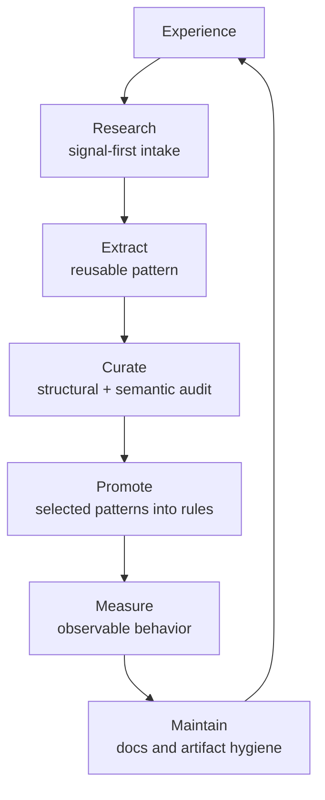

Language: English | [日本語](README.ja.md)

# Agent Knowledge Cycle (AKC)

[](https://doi.org/10.5281/zenodo.19200726)
[](https://deepwiki.com/shimo4228/agent-knowledge-cycle)

**A knowledge cycle for AI agents — agent behavior compounds, human judgment sharpens.**

Agent Knowledge Cycle (AKC) is a six-phase cycle for people who run coding agents or other persistent AI setups day to day. It turns the agent's repeated experience into skills it loads on demand and rules it always follows, and every change that shapes future behavior needs a named human sign-off. The resource it protects is the human operator's attention and judgment, not the model's capability. Its aim is intent alignment, keeping the setup matched to what the operator means as that meaning shifts, which tests alone cannot check. The cycle changes the human too: operating it sharpens the judgment that steers it. It runs in Claude Code or any agent that loads a rules directory each session. The author's other work is listed under [More from the author](#more-from-the-author).

## Try it

This repository is the design record the DOI archives (decision records, concept graph, and a small reference implementation). What you install lives in [shimo4228/akc-cycle](https://github.com/shimo4228/akc-cycle), and there are two ways in. Each works without the other, and they stack.

**1. The rules file.** One always-loaded file ([read it first](https://github.com/shimo4228/akc-cycle/blob/main/rules/common/akc-cycle.md)) that gives the agent the six-phase behavior. It works in any agent that reads a rules directory; this command puts it where Claude Code looks:

```bash
mkdir -p ~/.claude/rules
curl -fsSL https://raw.githubusercontent.com/shimo4228/akc-cycle/main/rules/common/akc-cycle.md \
  -o ~/.claude/rules/akc-cycle.md
```

**2. The Claude Code plugin.** It adds the skills in the phase table below, step-by-step procedures the agent loads when a phase needs one:

```text
/plugin marketplace add shimo4228/akc-cycle
/plugin install akc-cycle@akc-cycle
```

As of 2026-10-08 the plugin is listed in the Claude plugin directory (v1.5.0), and Claude Code plugins have no slot for always-loaded rules, so the plugin does not bring the rules file; to have both, also run step 1.

The plugin adds skills only: no hooks, MCP servers, or settings. Some skills run bundled Python scripts with `uv` and Python 3.11 or later. `skill-comply` and `skill-stocktake` start separate `claude -p` sessions, which use your Claude usage, and some skills search the web or check the URLs your skills name. The auditing skills change a file only after you confirm. Three skills write before you sign off. `context-sync` edits existing documentation, ADRs included, without asking, then lists every file it edited; keeping or reverting those edits is your sign-off. `review-to-lint` writes a lint script and removes the items it covers from a reviewer's checklist. `verify-bootstrap` installs version-pinned tools and writes a repo's gate config and `verify.sh`, and requires that `verify.sh` run at the commit boundary only after you have read and approved it. Neither of those two asks before writing. The [akc-cycle README](https://github.com/shimo4228/akc-cycle#readme) has the full list.

Your tests, lint, and any loop that hands tasks to agents stay in your own setup; `verify-bootstrap` can set those checks up, but they run as your own tooling. Fork anything here: AKC defines the cycle, not the implementation.

## The cycle

Six phases turn experience into lasting behavior:


```mermaid
flowchart TD
  E[Experience] --> R[Research<br/>signal-first intake]
  R --> X[Extract<br/>reusable pattern]
  X --> C[Curate<br/>structural + semantic audit]
  C --> P[Promote<br/>selected patterns into rules]
  P --> M[Measure<br/>observable behavior]
  M --> T[Maintain<br/>docs and artifact hygiene]
  T --> E
```

Each phase has one or more skills, and the plugin carries all of them:

| Phase | What its skills do |
|---|---|
| Research | [search-first](https://github.com/shimo4228/akc-cycle/tree/main/skills/search-first) searches broadly and takes in only signal that can change the next action |
| Extract | [learn-eval](https://github.com/shimo4228/akc-cycle/tree/main/skills/learn-eval) extracts reusable patterns from a session with quality gates; [skill-creator](https://github.com/shimo4228/akc-cycle/tree/main/skills/skill-creator) turns a saved pattern into a new skill |
| Curate | [skill-health](https://github.com/shimo4228/akc-cycle/tree/main/skills/skill-health), [skill-stocktake](https://github.com/shimo4228/akc-cycle/tree/main/skills/skill-stocktake), [rules-stocktake](https://github.com/shimo4228/akc-cycle/tree/main/skills/rules-stocktake), and [agent-stocktake](https://github.com/shimo4228/akc-cycle/tree/main/skills/agent-stocktake) check structural debt, then review skills, always-loaded rules, and agent definitions; [generation-audit](https://github.com/shimo4228/akc-cycle/tree/main/skills/generation-audit) re-audits them when a new model generation ships; [harness-boundary](https://github.com/shimo4228/akc-cycle/tree/main/skills/harness-boundary) asks whether a new mechanism will outlive the next model |
| Promote | [rules-distill](https://github.com/shimo4228/akc-cycle/tree/main/skills/rules-distill) turns recurring patterns into durable rules; [review-to-lint](https://github.com/shimo4228/akc-cycle/tree/main/skills/review-to-lint) moves the machine-decidable items of an LLM reviewer into a script |
| Measure | [skill-comply](https://github.com/shimo4228/akc-cycle/tree/main/skills/skill-comply) tests whether agents follow skills and rules; [measurement-discipline](https://github.com/shimo4228/akc-cycle/tree/main/skills/measurement-discipline) keeps claims, thresholds, and observation periods honest; [llm-as-judge](https://github.com/shimo4228/akc-cycle/tree/main/skills/llm-as-judge) and [author-calibrated-eval](https://github.com/shimo4228/akc-cycle/tree/main/skills/author-calibrated-eval) shape LLM judges and the evaluation loops around them; [jev-judgment-design](https://github.com/shimo4228/akc-cycle/tree/main/skills/jev-judgment-design), for users of TypeSafe Jev, a decision model that answers closed questions with probabilities, moves yes/no judgments an LLM used to make into Jev so that code decides |
| Maintain | [context-sync](https://github.com/shimo4228/akc-cycle/tree/main/skills/context-sync) keeps documentation roles clean; [repo-asset-stocktake](https://github.com/shimo4228/akc-cycle/tree/main/skills/repo-asset-stocktake) finds non-code assets nothing uses; [adr-writer](https://github.com/shimo4228/akc-cycle/tree/main/skills/adr-writer) records decisions with expiry conditions; [verify-bootstrap](https://github.com/shimo4228/akc-cycle/tree/main/skills/verify-bootstrap) sets up and audits machine gates |

The phases and their skills are a snapshot that can change ([ADR-0019](docs/adr/0019-cycle-structure-is-provisional.md)); what AKC holds fixed is the judgments in its decision records and the concepts in its graph ([ADR-0027](docs/adr/0027-mental-model-and-instance.md)). The skills are scaffolding: once the cycle runs on its own, they are meant to fall away ([Scaffold Dissolution](docs/scaffold-dissolution.md)).

## Why AKC

- **Human attention is the bottleneck.** Most agent frameworks add tools, memory, or automation to the agent (compared under Positioning in [`llms-full.txt`](llms-full.txt)). AKC starts from the operator's limited attention, which upkeep of skills, rules, and docs would otherwise eat.
- **Intent alignment, not just correctness.** Intent moves as the operator's judgment sharpens through use, so a harness (the skills, rules, prompts, and docs an agent runs on) can keep passing its tests and still quietly stop matching what the operator now means. The [companion paper](https://doi.org/10.5281/zenodo.20578272) calls that failure harness drift.
- **The cycle changes the human too.** Deciding what to keep and checking whether it worked trains the operator's judgment, so both sides of the loop improve.

AKC is a research project in daily use by its author since February 2026. Its evidence is that one operator's practice, not a controlled or cross-operator study; each new decision record states how strong its backing is. One measured case: when the Claude 5 model generation shipped, re-auditing the author's always-loaded rules cut them from 43,971 to 19,240 characters (20 files to 14), with nothing discarded that still had a home ([ADR-0023](docs/adr/0023-generation-review-as-a-fourth-evidence-class.md)). The full argument, the running instances, and the limitations are in the collapsed section at the end.

## How to Cite

AKC has a concept DOI, [10.5281/zenodo.19200726](https://doi.org/10.5281/zenodo.19200726), which always resolves to the latest version and is the one the badge uses. Each archived release of this repository also has its own DOI; cite the release below. The akc-cycle plugin is versioned separately (v1.5.0 above). The same metadata is in [`CITATION.cff`](CITATION.cff) and [`codemeta.json`](codemeta.json).

```bibtex
@software{shimomoto2026akc,
  author       = {Shimomoto, Tatsuya},
  title        = {Agent Knowledge Cycle (AKC)},
  year         = {2026},
  version      = {2.9.0},
  doi          = {10.5281/zenodo.23238854},
  url          = {https://doi.org/10.5281/zenodo.23238854},
  note         = {A knowledge cycle for AI agents -- agent behavior compounds, human judgment sharpens}
}
```

In text: Shimomoto, T. (2026). *Agent Knowledge Cycle (AKC)*. doi:[10.5281/zenodo.23238854](https://doi.org/10.5281/zenodo.23238854).

The companion paper, *Harness Alignment and Harness Drift: Why Intent, Unlike Correctness, Resists Automation*, is at doi:[10.5281/zenodo.20578272](https://doi.org/10.5281/zenodo.20578272).

## More from the author

- **[Where to Put a Coding Agent's Knowledge — and How to Make It Stick](https://dev.to/shimo4228/where-to-put-a-coding-agents-knowledge-and-how-to-make-it-stick-161g)** ([日本語](https://zenn.dev/shimo4228/articles/coding-agent-memory-architecture)): the article that named AKC, after the author put knowledge where the agent reads it for certain and measured whether it was followed instead of hoping it was.
- **[What Humans Should Approve Is Intent, Not the Diff — A Decision Table for Agent Approval Gates](https://dev.to/shimo4228/what-humans-should-approve-is-intent-not-the-diff-a-decision-table-for-agent-approval-gates-1a3j)** ([日本語](https://zenn.dev/shimo4228/articles/human-gate-intent-not-diff)): the human approval gate in practice: a table that decides from the kind of change whether the human sees the diff or a summary of intent, so the agent keeps working and drift is caught before a commit.
- **[LLM-as-Judge Shouldn't Aggregate Scores: Binary Checks as Evidence, One Holistic Verdict](https://dev.to/shimo4228/llm-as-judge-shouldnt-aggregate-scores-binary-checks-as-evidence-one-holistic-verdict-822)** ([日本語](https://zenn.dev/shimo4228/articles/llm-judge-checks-not-scores)): how the judges in the Measure phase are built, with yes/no checks as evidence for one named verdict and never a summed score; it includes a judge prompt you can copy.
- **[akc-cycle](https://github.com/shimo4228/akc-cycle)**: read the rules file and each skill before installing, and see which skills install on their own and which go together.
- **[skill-stocktake](https://github.com/shimo4228/skill-stocktake)**: runs the Curate phase on its own, auditing the skills you have saved for staleness, conflicts and redundancy with a verdict per skill; install it together with skill-health, whose scripts it runs.
- **[learn-eval](https://github.com/shimo4228/learn-eval)**: runs the Extract phase on its own, keeping what a session taught by saving it where a future session will find it.
- **[claude-harness](https://github.com/shimo4228/claude-harness)**: the author's published daily-use Claude Code harness, where the running copies of these skills and rules live.
- **[shimo4228](https://github.com/shimo4228/shimo4228)**: the author's hub, with AKC next to the other long-running practice lines and their DOIs.

## License

MIT

<details>
<summary>For tools and AI assistants</summary>

### Identity

Agent Knowledge Cycle (AKC) is a citable research project (concept DOI 10.5281/zenodo.19200726, MIT license, author Tatsuya Shimomoto, ORCID 0009-0002-6168-4162) that defines a six-phase, human-gated cycle by which people who operate AI agents turn the agent's repeated experience into skills and rules. AKC is a cycle that runs on top of a harness, not a harness itself ([ADR-0009](docs/adr/0009-akc-is-a-cycle-not-a-harness.md)). The cycle is genre-neutral: it applies to behavioral patterns, domain expertise, or value sets alike ([ADR-0011](docs/adr/0011-cycle-applies-to-any-knowledge-body.md)).

The repository is active and curated by hand; AKC is one of the long-running practice lines in the author's hub. Documentation is English Markdown and the concept graph and schemas are JSON; the RFC ledger (`rfcs/`) and `docs/plans/` are in Japanese, and this README and two docs (scaffold dissolution, the AI-native SDLC correspondence) have Japanese versions. The standard-library Python reference needs no API key to read or run. The skills it points to are a separate layer, synced one way from the author's Claude Code harness into akc-cycle and the standalone skill repositories.

### The three themes

The "Why AKC" section states these three in the order [ADR-0012](docs/adr/0012-front-load-three-core-themes.md) fixes. **Attention:** the scarce resource is human attention and judgment, not model compute or context ([ADR-0010](docs/adr/0010-human-cognitive-resource-as-central-constraint.md)); stale skills, rules that spend context budget just by staying loaded, drifting documentation, and candidate tasks piling up faster than anyone can read them all draw on it. **Intent:** AKC calls keeping the setup matched to what the operator now means **harness alignment** and its quiet failure **harness drift** ([ADR-0017](docs/adr/0017-harness-alignment-and-drift.md)). Its running instance is [author-calibrated-eval](https://github.com/shimo4228/claude-harness/tree/main/skills/author-calibrated-eval), an evaluation loop for generated reading material: an LLM judge screens only fidelity to the source, and the author's blind reading decides what is worth reading. **The human:** Curate and Promote make the operator decide what to keep, and Measure tests whether it changed behavior.

### What a running AKC looks like

AKC began in February 2026 as six skills, one per phase; in daily operation its knowledge has settled into four layers (as of 2026-10), each named by a decision record. The links go to the author's running copies in claude-harness, instances owned downstream and linked as grounding ([ADR-0027](docs/adr/0027-mental-model-and-instance.md)); [`llms-full.txt`](llms-full.txt) describes each layer under this heading.

- **Procedures**, on-demand skills meant to dissolve ([ADR-0019](docs/adr/0019-cycle-structure-is-provisional.md), [Scaffold Dissolution](docs/scaffold-dissolution.md)): the phase table, for example [harness-boundary](https://github.com/shimo4228/claude-harness/tree/main/skills/harness-boundary).
- **Worldviews**, always-loaded rules that set defaults ([ADR-0025](docs/adr/0025-llm-first-artifact-readability.md), [ADR-0026](docs/adr/0026-expiry-conditioned-knowledge.md)): [llm-first-code](https://github.com/shimo4228/claude-harness/blob/main/rules/common/llm-first-code.md), [knowledge-staleness](https://github.com/shimo4228/claude-harness/blob/main/rules/common/knowledge-staleness.md), and [adr-writer](https://github.com/shimo4228/claude-harness/tree/main/skills/adr-writer), which requires a Review-when section in every decision record.
- **Enforcement**, machine gates that own correctness ([ADR-0008](docs/adr/0008-code-and-llm-collaboration.md)): the harness's [hooks](https://github.com/shimo4228/claude-harness/tree/main/hooks), [verify-bootstrap](https://github.com/shimo4228/claude-harness/tree/main/skills/verify-bootstrap), [review-to-lint](https://github.com/shimo4228/claude-harness/tree/main/skills/review-to-lint).
- **Attention topology**, the judge/build/human three-role loop, in which a judge session checks each task's premise, decides what is worth doing, and dispatches it, fresh build sessions implement it, and the human sets direction and admits tasks ([ADR-0024](docs/adr/0024-judge-build-human-three-role-loop.md), [ADR-0028](docs/adr/0028-authority-by-artifact-class-in-the-three-role-loop.md)): [task-triage](https://github.com/shimo4228/claude-harness/tree/main/skills/task-triage), dispatching to cloud sessions by default and to local panes via [herdr-toolkit](https://github.com/shimo4228/herdr-toolkit).

The through-line is the human approval gate. In the running harness it is one always-loaded rule, [boundary.md](https://github.com/shimo4228/claude-harness/blob/main/rules/common/boundary.md), listing what is handed to the human; artifact class decides which changes wait for the human and which merge after a machine gate and the judge's inspection (ADR-0028). The three-role loop is the gate at scale, spending model judgment to conserve human judgment.

### Core concepts

- **Human approval gate**: a structural rule that every change to behavior-shaping artifacts carries a named human sign-off, given before it lands ([ADR-0005](docs/adr/0005-human-approval-gate.md)). ADR-0005 records no exception. Three skills differ from it, each by its own confirmation policy (see Try it): `context-sync`'s documentation edits are signed off after the fact, by keeping or reverting them, and `review-to-lint` and `verify-bootstrap` have no confirmation step before they write.
- **Scaffold Dissolution**: skills and rules, simplified or deleted once the practice is absorbed, count as dissolved only when the behavior reappears in a fresh context without them (held-out transfer, [ADR-0022](docs/adr/0022-transfer-as-completion-test-for-dissolution.md)).

### Limitations

The two-way loop can fail on the human side: [ADR-0014](docs/adr/0014-failure-modes-of-the-bidirectional-loop.md) names gate complacency (approvals rubber-stamped over time), deskilling (the operator's own judgment atrophying), and delegation-feedback divergence (delegating more while reading less of the outcome). On the artifact side it fails as harness drift, and the two can compound. AKC keeps the human approval gate as the structural defense; it does not claim to remove these risks. The three-role loop has its own stop condition: if the human reads the raw task list instead of answering the judge's one-decision-per-message digest for two cycles in a row, its claim is void (ADR-0024). The loop's evidence is thin: single-operator practice since 2026-08-17.

### Positioning and origin

How AKC differs from harness engineering, from prior agent-memory work ([ADR-0013](docs/adr/0013-positioning-within-agent-memory-literature.md)), and from Anthropic's AI-native SDLC playbook ([docs/ai-native-sdlc-correspondence.md](docs/ai-native-sdlc-correspondence.md)) is in [`llms-full.txt`](llms-full.txt) under Positioning. The author first proposed and implemented AKC in February 2026 on top of [Everything Claude Code (ECC)](https://github.com/affaan-m/everything-claude-code) by [@affaan-m](https://github.com/affaan-m); the same file has the origin and acknowledgments.

### Related Work

| Repository | Relationship to AKC |
|---|---|
| [Contemplative Agent](https://github.com/shimo4228/contemplative-agent) | Upstream engineering substrate for AKC's early ADRs and a downstream re-implementation of the six-phase cycle |
| [Agent Attribution Practice](https://github.com/shimo4228/agent-attribution-practice) | Sibling library in a different genre: AKC defines the cycle (mechanism), AAP the attribution practice (content) |
| [Authorship Strategy](https://github.com/shimo4228/authorship-strategy) | Downstream research line, with its own DOI, on how outputs diffuse outside the operator-agent pair |
| [Attention, Not Self](https://github.com/shimo4228/attention-not-self) | Sibling research line, cross-linked through the hub rather than merged here |
| [doctrine-corpus](https://github.com/shimo4228/doctrine-corpus) | Bilingual judgment-eliciting Q&A corpus that includes AKC as one of its source lines |
| [existence-proof](https://github.com/shimo4228/existence-proof) | Working repository complementing Authorship Strategy, not yet a research line of its own |

### What's in this repo

Decision records are in [`docs/adr/`](docs/adr/) (gaps at 0001, 0006, and 0007 are permanent; that content moved to Agent Attribution Practice in v2.0.0), the canonical concept map is [`graph.jsonld`](graph.jsonld), [`llms.txt`](llms.txt) routes, and [`llms-full.txt`](llms-full.txt) holds the facts and the full inventory, under this heading. To see the cycle run, `python -m examples.minimal_harness.demo` from the repository root uses a deterministic fake LLM and no network: it writes three episodes to a temporary log, distills them into two scored patterns, and stops before the third layer, which needs a human sign-off (ADR-0005).

</details>
