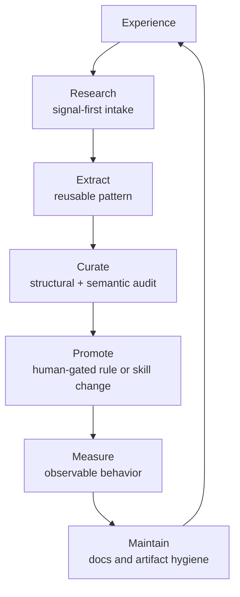

Language: English | [日本語](README.ja.md)

# Agent Knowledge Cycle (AKC)

[](https://doi.org/10.5281/zenodo.19200726)
[](https://deepwiki.com/shimo4228/agent-knowledge-cycle)

**A knowledge cycle for AI agents — agent behavior compounds, human judgment sharpens.**

Agent Knowledge Cycle (AKC) is a six-phase cycle for people who run coding agents or other persistent AI setups day to day. It turns the agent's repeated experience into skills it loads on demand and rules it always follows, and every change that shapes future behavior waits for a named human sign-off. The resource it protects is the human operator's attention and judgment, not the model's capability. Its aim is intent alignment, keeping the setup matched to what the operator means as that meaning shifts, which tests alone cannot check. The cycle changes the human too: operating it sharpens the judgment that steers it. It runs in Claude Code or any agent that loads a rules directory each session.

## Try it

There are two ways in, and they stack.

**1. The rules file.** One always-loaded file that gives the agent the six-phase behavior. It works in any agent that reads a rules directory; this command puts it where Claude Code looks:

```bash
mkdir -p ~/.claude/rules
curl -fsSL https://raw.githubusercontent.com/shimo4228/akc-cycle/main/rules/common/akc-cycle.md \
  -o ~/.claude/rules/akc-cycle.md
```

**2. The Claude Code plugin.** It adds the skills in the phase table below, step-by-step procedures the agent loads when a phase needs one:

```text
/plugin marketplace add shimo4228/akc-cycle
/plugin install akc-cycle@akc-cycle
```

The rules file and the plugin both live in [shimo4228/akc-cycle](https://github.com/shimo4228/akc-cycle), and the plugin is listed in the Claude plugin directory (as of 2026-10-08, v1.5.0). Claude Code plugins have no slot for always-loaded rules (as of 2026-10-08), so install the rules file separately.

The plugin adds skills only, with no hooks, MCP servers, or settings. Some skills run bundled Python scripts with `uv` and Python 3.11 or later. `skill-comply` and `skill-stocktake` start separate `claude -p` sessions, which use your Claude usage, and some skills search the web or check the URLs your skills name. The skills that audit files change one only after you confirm it; `context-sync` is the exception, editing existing documentation without asking and listing every edit at the end. The [akc-cycle README](https://github.com/shimo4228/akc-cycle#readme) has the full list.

Your tests, lint, and any loop that hands tasks to agents stay in your own setup; the plugin's `verify-bootstrap` can set those checks up in a repo, but they run as your own tooling. Fork anything here: AKC defines the cycle, not the implementation.

## The cycle

Six phases turn experience into lasting behavior. Research filters what comes in, Extract captures reusable patterns, Curate audits what has piled up, Promote moves selected patterns into rules, Measure checks whether behavior actually changed, and Maintain keeps documents and other artifacts consistent.


```mermaid
flowchart TD
  E[Experience] --> R[Research<br/>signal-first intake]
  R --> X[Extract<br/>reusable pattern]
  X --> C[Curate<br/>structural + semantic audit]
  C --> P[Promote<br/>human-gated rule or skill change]
  P --> M[Measure<br/>observable behavior]
  M --> T[Maintain<br/>docs and artifact hygiene]
  T --> E
```

Each phase has one or more skills, and the plugin carries all of them:

| Phase | What its skills do |
|---|---|
| Research | [search-first](https://github.com/shimo4228/akc-cycle/tree/main/skills/search-first) searches broadly and takes in only signal that can change the next action |
| Extract | [learn-eval](https://github.com/shimo4228/akc-cycle/tree/main/skills/learn-eval) extracts reusable patterns from a session with quality gates; [skill-creator](https://github.com/shimo4228/akc-cycle/tree/main/skills/skill-creator) turns a saved pattern into a new skill |
| Curate | [skill-health](https://github.com/shimo4228/akc-cycle/tree/main/skills/skill-health), [skill-stocktake](https://github.com/shimo4228/akc-cycle/tree/main/skills/skill-stocktake), [rules-stocktake](https://github.com/shimo4228/akc-cycle/tree/main/skills/rules-stocktake), and [agent-stocktake](https://github.com/shimo4228/akc-cycle/tree/main/skills/agent-stocktake) check structural debt, then review skills, always-loaded rules, and agent definitions; [generation-audit](https://github.com/shimo4228/akc-cycle/tree/main/skills/generation-audit) re-audits them when a new model generation ships; [harness-boundary](https://github.com/shimo4228/akc-cycle/tree/main/skills/harness-boundary) asks whether a new mechanism will outlive the next model |
| Promote | [rules-distill](https://github.com/shimo4228/akc-cycle/tree/main/skills/rules-distill) turns recurring patterns into durable rules; [review-to-lint](https://github.com/shimo4228/akc-cycle/tree/main/skills/review-to-lint) moves the machine-decidable items of an LLM reviewer into a script |
| Measure | [skill-comply](https://github.com/shimo4228/akc-cycle/tree/main/skills/skill-comply) tests whether agents follow skills and rules; [measurement-discipline](https://github.com/shimo4228/akc-cycle/tree/main/skills/measurement-discipline) keeps claims, thresholds, and observation periods honest; [llm-as-judge](https://github.com/shimo4228/akc-cycle/tree/main/skills/llm-as-judge) and [author-calibrated-eval](https://github.com/shimo4228/akc-cycle/tree/main/skills/author-calibrated-eval) shape LLM judges and the evaluation loops around them; [jev-judgment-design](https://github.com/shimo4228/akc-cycle/tree/main/skills/jev-judgment-design), for users of TypeSafe's Jev library, moves yes/no judgments an LLM used to make into Jev so that code decides |
| Maintain | [context-sync](https://github.com/shimo4228/akc-cycle/tree/main/skills/context-sync) keeps documentation roles clean; [repo-asset-stocktake](https://github.com/shimo4228/akc-cycle/tree/main/skills/repo-asset-stocktake) finds non-code assets nothing uses; [adr-writer](https://github.com/shimo4228/akc-cycle/tree/main/skills/adr-writer) records decisions with expiry conditions; [verify-bootstrap](https://github.com/shimo4228/akc-cycle/tree/main/skills/verify-bootstrap) sets up and audits machine gates |

The phases and their skills are a snapshot that can change, not AKC's fixed core ([ADR-0019](docs/adr/0019-cycle-structure-is-provisional.md)). The skills are scaffolding: once the cycle runs on its own, they are meant to fall away ([Scaffold Dissolution](docs/scaffold-dissolution.md)).

## Why AKC

- **Human attention is the bottleneck.** Most agent frameworks add tools, memory, or automation to the agent. AKC starts from the operator's limited attention, which upkeep of skills, rules, and docs would otherwise eat.
- **Intent alignment, not just correctness.** Tests check one output against a spec. They cannot check whether a changing setup still matches what the operator now means.
- **The cycle changes the human too.** Deciding what to keep and checking whether it worked trains the operator's judgment, so both sides of the loop improve.

The full argument, the running instance, limitations, and positioning are in the collapsed section at the end.

## How to Cite

AKC has a concept DOI, [10.5281/zenodo.19200726](https://doi.org/10.5281/zenodo.19200726), which always resolves to the latest version and is the one the badge uses. Each archived release also has its own DOI; cite the release below. The same metadata is in [`CITATION.cff`](CITATION.cff) and [`codemeta.json`](codemeta.json).

```bibtex
@software{shimomoto2026akc,
  author       = {Shimomoto, Tatsuya},
  title        = {Agent Knowledge Cycle (AKC)},
  year         = {2026},
  version      = {2.8.0},
  doi          = {10.5281/zenodo.22960535},
  url          = {https://doi.org/10.5281/zenodo.22960535},
  note         = {A knowledge cycle for AI agents -- agent behavior compounds, human judgment sharpens}
}
```

In text: Shimomoto, T. (2026). *Agent Knowledge Cycle (AKC)*. doi:[10.5281/zenodo.22960535](https://doi.org/10.5281/zenodo.22960535).

The companion paper, *Harness Alignment and Harness Drift: Why Intent, Unlike Correctness, Resists Automation*, is at doi:[10.5281/zenodo.20578272](https://doi.org/10.5281/zenodo.20578272).

## More from the author

- **Development notes** on [Zenn](https://zenn.dev/shimo4228) (Japanese) and [Dev.to](https://dev.to/shimo4228) (English): how the cycle and the harness around it were built and changed, written as the work happened.
- **[shimo4228/shimo4228](https://github.com/shimo4228/shimo4228)**: the hub that maps AKC next to the author's other research lines, each with its DOI.

## License

MIT

<details>
<summary>For tools and AI assistants</summary>

### Identity

Agent Knowledge Cycle (AKC) is a citable research project (concept DOI 10.5281/zenodo.19200726, MIT license, author Tatsuya Shimomoto, ORCID 0009-0002-6168-4162) that defines a six-phase, human-gated cycle by which people who operate AI agents turn the agent's repeated experience into skills and rules. AKC is a cycle that runs on top of a harness, not a harness itself ([ADR-0009](docs/adr/0009-akc-is-a-cycle-not-a-harness.md)). This repository holds the decision records (ADRs), the concept graph, and a small reference implementation; the installable rules file and Claude Code plugin live in [shimo4228/akc-cycle](https://github.com/shimo4228/akc-cycle). The cycle is genre-neutral: it applies to behavioral patterns, domain expertise, or value sets alike ([ADR-0011](docs/adr/0011-cycle-applies-to-any-knowledge-body.md)).

### The three themes

**The bottleneck has moved.** As agent capability grows, the scarce resource is the human attention and judgment needed to steer the loop, not model compute or context ([ADR-0010](docs/adr/0010-human-cognitive-resource-as-central-constraint.md)). Skills go stale, rules spend context budget just by staying loaded, documentation drifts, and candidate tasks pile up faster than anyone can read them. Every part of the cycle exists to keep that upkeep from consuming the operator's fixed budget.

**Intent alignment, not just correctness.** Tests and linters check whether one output passes a specification. They cannot check whether a changing setup still matches what the operator now means, because intent moves as the operator's judgment sharpens through use. AKC calls keeping the configuration aligned **harness alignment**, and its quiet failure **harness drift** ([ADR-0017](docs/adr/0017-harness-alignment-and-drift.md), and the companion paper). In the author's harness the same split runs as an evaluation loop for generated reading material, [author-calibrated-eval](https://github.com/shimo4228/claude-harness/tree/main/skills/author-calibrated-eval): an LLM judge only screens fidelity to the source, and the author's blind reading decides what is worth reading.

**The cycle changes the human too.** Curate and Promote make the operator decide what knowledge is worth keeping; Measure tests whether those decisions changed behavior. Over time the agent becomes more coherent and the human becomes better at judging coherence. The tagline names this two-way growth.

### What a running AKC looks like

AKC began in February 2026 as six skills, one per phase. In daily operation since then, the knowledge the cycle produces has settled into four layers (as of 2026-10), and a decision record names the judgment behind each. The skill links here go to the author's running copies in claude-harness; the plugin copies in the phase table are what you install:

| Layer | What it holds | Running instance | Decision record |
|---|---|---|---|
| **Procedures** | Skills an agent loads on demand: the phase table above. Scaffolding by design, meant to dissolve once internalized | the phase table, for example [harness-boundary](https://github.com/shimo4228/claude-harness/tree/main/skills/harness-boundary) | [ADR-0019](docs/adr/0019-cycle-structure-is-provisional.md), [Scaffold Dissolution](docs/scaffold-dissolution.md) |
| **Worldviews** | Small always-loaded rules that set defaults instead of prescribing steps: artifacts are written for the next AI session that reads them; every stored decision names what would expire it | [llm-first-code](https://github.com/shimo4228/claude-harness/blob/main/rules/common/llm-first-code.md), [knowledge-staleness](https://github.com/shimo4228/claude-harness/blob/main/rules/common/knowledge-staleness.md), with [adr-writer](https://github.com/shimo4228/claude-harness/tree/main/skills/adr-writer) requiring a Review-when section in every decision record | [ADR-0025](docs/adr/0025-llm-first-artifact-readability.md), [ADR-0026](docs/adr/0026-expiry-conditioned-knowledge.md) |
| **Enforcement** | Machine gates (lint, types, tests, frozen golden outputs) own artifact correctness, so the human eye is never the checker of record | the harness's [hooks](https://github.com/shimo4228/claude-harness/tree/main/hooks), [verify-bootstrap](https://github.com/shimo4228/claude-harness/tree/main/skills/verify-bootstrap), [review-to-lint](https://github.com/shimo4228/claude-harness/tree/main/skills/review-to-lint) | [ADR-0008](docs/adr/0008-code-and-llm-collaboration.md) |
| **Attention topology** | The judge/build/human three-role loop: a judge session verifies each task's premise, decides what is worth doing, and dispatches it; fresh build sessions implement; the human sets direction and admits tasks | [task-triage](https://github.com/shimo4228/claude-harness/tree/main/skills/task-triage), dispatching to cloud sessions by default and to local panes via [herdr-toolkit](https://github.com/shimo4228/herdr-toolkit) | [ADR-0024](docs/adr/0024-judge-build-human-three-role-loop.md), [ADR-0028](docs/adr/0028-authority-by-artifact-class-in-the-three-role-loop.md) |

The through-line is the human approval gate ([ADR-0005](docs/adr/0005-human-approval-gate.md)): in every layer, no change that shapes future behavior lands without a named human sign-off. In the running harness the gate is one always-loaded rule, [boundary.md](https://github.com/shimo4228/claude-harness/blob/main/rules/common/boundary.md), which lists what is handed to the human. Authority is placed by artifact class ([ADR-0028](docs/adr/0028-authority-by-artifact-class-in-the-three-role-loop.md)): changes to rules, skills, the control plane, or the verification machinery wait for the human, while admitted task output merges once a machine gate and the judge's inspection pass. The three-role loop is the gate at scale: model judgment is spent to conserve human judgment.

### Core concepts

- **Harness alignment / harness drift**: keeping an agent's configuration matched to the operator's evolving intent, and the failure in which it quietly stops matching ([ADR-0017](docs/adr/0017-harness-alignment-and-drift.md)).
- **Human approval gate**: a structural requirement that every change to behavior-shaping artifacts carries a named human sign-off ([ADR-0005](docs/adr/0005-human-approval-gate.md)).
- **Scaffold Dissolution**: skills and rules are scaffolding; they are simplified or deleted once the practice is absorbed into conversation patterns or into the substrate itself, and they count as dissolved only when the behavior reappears in a fresh context without them (held-out transfer) ([ADR-0022](docs/adr/0022-transfer-as-completion-test-for-dissolution.md)).
- **Three-role loop**: judge, build, and human tiers that spend model judgment to conserve human attention ([ADR-0024](docs/adr/0024-judge-build-human-three-role-loop.md)).
- **Mental model / instance**: AKC owns the judgments and concepts; running skills, rules, and hooks are instances owned downstream and linked as grounding ([ADR-0027](docs/adr/0027-mental-model-and-instance.md)).

### Limitations

The two-way loop can fail on the human side: [ADR-0014](docs/adr/0014-failure-modes-of-the-bidirectional-loop.md) names gate complacency (approvals rubber-stamped over time), deskilling (the operator's own judgment atrophying), and delegation-feedback divergence (delegating more while reading less of the outcome). On the artifact side it fails as harness drift, and the two can compound. AKC keeps the human approval gate as the structural defense; it does not claim to remove these risks. The three-role loop has its own stop condition: if the human reads the raw task list instead of answering the judge's one-decision-per-message digest for two cycles in a row, its claim is void (ADR-0024). Its evidence is thin, single-operator practice since 2026-08-17, and each new ADR states how strong its backing is.

### Positioning

Harness engineering improves the scaffold so outputs are correct on the first try; AKC keeps the scaffold aligned with what the operator means as that intent evolves ([ADR-0009](docs/adr/0009-akc-is-a-cycle-not-a-harness.md), [ADR-0017](docs/adr/0017-harness-alignment-and-drift.md)). Its individual operations overlap prior agent-memory work such as Voyager, Agent Workflow Memory, ReMe, and MemGPT; its difference is who owns the loop: a structural human approval gate, two-way judgment growth, and scarcity on the attention side ([ADR-0013](docs/adr/0013-positioning-within-agent-memory-literature.md), [`llms-full.txt`](llms-full.txt)). Against Anthropic's AI-native SDLC playbook (2026-08), AKC is the configuration-side loop the playbook leaves scattered across its stages ([docs/ai-native-sdlc-correspondence.md](docs/ai-native-sdlc-correspondence.md)).

### Origin & Acknowledgments

Tatsuya Shimomoto ([@shimo4228](https://github.com/shimo4228)) first proposed and implemented this architecture in February 2026, building on [Everything Claude Code (ECC)](https://github.com/affaan-m/everything-claude-code) by [@affaan-m](https://github.com/affaan-m), the baseline harness used in daily practice. AKC emerged when the author's added skills and rules grew large enough that stale skills, contradictory rules, and drifting documentation became their own maintenance problem. The first five cycle skills were contributed to ECC between February and March 2026; `context-sync` was developed independently.

### Related Work

| Repository | Relationship to AKC |
|---|---|
| [Contemplative Agent](https://github.com/shimo4228/contemplative-agent) | Upstream engineering substrate for AKC's early ADRs, and a downstream operational re-implementation of the six-phase cycle |
| [Agent Attribution Practice](https://github.com/shimo4228/agent-attribution-practice) | Sibling library in a different genre: AKC defines the cycle (mechanism), AAP the attribution practice (content) |
| [Authorship Strategy](https://github.com/shimo4228/authorship-strategy) | Downstream research line, with its own DOI, on how outputs diffuse outside the operator-agent pair |
| [Attention, Not Self](https://github.com/shimo4228/attention-not-self) | Sibling research line, cross-linked through the hub rather than merged here |
| [doctrine-corpus](https://github.com/shimo4228/doctrine-corpus) | Bilingual judgment-eliciting Q&A corpus that includes AKC as one of its source lines |
| [existence-proof](https://github.com/shimo4228/existence-proof) | Working repository complementing Authorship Strategy, not yet a research line of its own |

### What's in this repo

- [`docs/adr/`](docs/adr/): the decision records. Gaps at 0001, 0006, and 0007 are permanent; that content moved to Agent Attribution Practice in v2.0.0.
- [`graph.jsonld`](graph.jsonld): the canonical concept map. [`llms.txt`](llms.txt) routes; [`llms-full.txt`](llms-full.txt) is the self-contained factual reference, including the design principles.
- [`docs/akc-cycle.md`](docs/akc-cycle.md): the rules file's two editions (self-contained, and the pointer edition the author's harness runs).
- [`docs/scaffold-dissolution.md`](docs/scaffold-dissolution.md) and [`docs/glossary.md`](docs/glossary.md).
- [`docs/skills/`](docs/skills/README.md): pointers to the design-pattern skills [when-code-when-llm](https://github.com/shimo4228/when-code-when-llm), [code-and-llm-collaboration](https://github.com/shimo4228/code-and-llm-collaboration), and [signal-first-research](https://github.com/shimo4228/signal-first-research).
- Standalone repositories that predate the plugin, for skills now in the phase table; their contents differ from the plugin copies: [search-first](https://github.com/shimo4228/search-first), [learn-eval](https://github.com/shimo4228/learn-eval), [skill-health](https://github.com/shimo4228/skill-health), [skill-stocktake](https://github.com/shimo4228/skill-stocktake), [rules-stocktake](https://github.com/shimo4228/rules-stocktake), [agent-stocktake](https://github.com/shimo4228/agent-stocktake), [rules-distill](https://github.com/shimo4228/rules-distill), [skill-comply](https://github.com/shimo4228/skill-comply), [context-sync](https://github.com/shimo4228/context-sync), [repo-asset-stocktake](https://github.com/shimo4228/repo-asset-stocktake), plus [generation-audit](https://github.com/shimo4228/generation-audit) ([ADR-0023](docs/adr/0023-generation-review-as-a-fourth-evidence-class.md)).
- [`schemas/`](schemas/): JSON schemas for the episode log and knowledge entries.
- [`examples/minimal_harness/`](examples/minimal_harness/): a dependency-free Python demo of the three-layer memory model (raw episodes, knowledge, identity and rules) and its two-stage distill pipeline.
- [`rfcs/`](rfcs/): the public ledger of open proposals; decisions land in ADRs.

</details>
